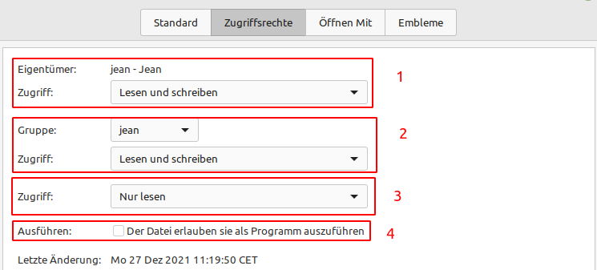

Benutzer und Berechtigungen
===========================
Das Benutzer-, Gruppen- und Berechtigungssystem unter Linux ist sehr tiefgründig.
Wir werden nur relevante Themen behandeln.

Benutzer und Gruppen
--------------------
Im Programm ``Benutzer und Gruppen`` können Sie

- Ihr Passwort ändern
- Ihren angezeigen Namen ändern (kosmetisch)
- Den Kontotyp zwischen ``Standard`` und ``Systemverwalter`` (Administrator) einstellen
- Weitere Berechtigungen über den Eintrag in Gruppen definieren.

Gruppen
^^^^^^^
Mit dem Eintrag von Gruppen kann man definieren, was ein Benutzer machen darf und was nicht.
Im Linux-Desktop Bereich scheint das Gruppen-Berechtigungs-System allerdings sehr stiefmütterlich behandelt zu sein und ist an vielen Stellen obsolet.
Wir werden daher nur auf die wichtigen Gruppen eingehen, welche für uns im Desktop-Bereich weiterhin relevant sind:

- **cdrom:** Das DVD/CD-Laufwerk darf benutzt werden
- **lpadmin:** Drucker dürfen verwaltet und eingerichtet werden. (Drucken kann man auch ohne diese Gruppe)
- **plugdev:** USB-Sticks, Partitionen, externe Laufwerke können ein/ausgehängt werden
- **sambashare:** Ordner-Freigaben dürfen mit Samba erstellt werden
- **sudo:** Administrations-Rechte (!)
- **nopasswdlogin:** Jeder kann sich ohne Eingabe des Passworts einloggen

Gruppen können im Programm ``Benutzer und Gruppen`` für jeden Nutzer verwaltet werden.
Die anderen verfügbaren Gruppen können Sie als Desktop-Nutzer getrost ignorieren.
Für Server-Administratoren ist dieser Punkt wesentlich spannender.

Administrator (sudo)
^^^^^^^^^^^^^^^^^^^^
Ist ein Benutzer in der Gruppe ``sudo`` eingetragen, oder "heißt" er ``root`` hat er Administrations-Rechte.

.. note:: Hintergrundinformationen:
    *In Linux Mint wurde der Benutzer* ``root`` *weitestgehend abgeschafft. 
    Von daher existiert dieser Benutzer nicht richtig.
    Man kann sich also nicht als Administrator anmelden, sondern hat als Benutzer eben nur Administrator-Rechte mit der Gruppe* ``sudo``.
    *Möchte man etwas als Administrator tätigen, muss sich der Nutzer nochmal explizit mit seinem Passwort verifizieren. 
    (Dafür sind die Programme* ``sudo`` *oder* ``pkexec`` *zuständig)*

Ein Administrator kann unter anderem folgende Dinge erledigen:

- Benutzer hinzufügen, entfernen, Gruppen ändern, andere Administratoren löschen
- Alle Dateien sehen, ändern, löschen. ALLE. (Auch die von anderen Benutzern und Administratoren, sofern diese nicht explizit verschlüsselt sind)
- Programme aktualisieren, entfernen, installieren
- Das System in jeder Hinsicht verändern
- Andere Festplatten und installierte Systeme auslesen, verändern, oder sogar ausführen.
- Einfach alles

.. warning:: 
    Gehen Sie daher nicht leichtfähig mit diesem Recht um!

    Achten Sie auch immer darauf, wenn nach Ihrem Passwort während der Nutzung von Linux gefragt wird. 
    In fast allen Fällen (bis auf das Entsperren des Schlüsselbunds oder SSH-Keys) wird nach dem Passwort gefragt, 
    wenn das Programm Administrations-Rechte braucht. 

Dateirechte
-----------
Für Dateien gibt es auf Linux ein einfaches, dennoch effektives Berechtigungssystem.

Eine Datei oder ein Ordner hat einen Eigentümer und eine Gruppe, der er zugewiesen werden kann.
Gruppen werden Sie höchstwahrscheinlich nicht brauchen.

Grafisch einstellen können Sie diese im Dateimanger unter den Dateigenschaften im Reiter ``Zugriffsrechte``.

1. Der Eigentümer einer Datei kann verändert werden und definiert werden, was der Besitzer mit der Datei machen darf.
2. Das selbe gilt für die Gruppe. Wir empfehlen die Gruppe unberührt zu lassen und die gleichen Rechte wie beim Besitzer einzutragen.
3. Hier kann man die Rechte eintragen, die alle Anderen über diese Datei haben.
4. Ist die Datei ein Skript oder ein Programm, kann man hier einstellen, dass man die Datei als Programm ausführen kann.

.. note:: 
    Die Dateirechte einer Datei oder eines Ordners können nur durch den Besitzer oder einen Administratoren geändert werden.

.. warning:: 
    Momentan können Nutzer noch standardmäßig die Dateien der anderen Nutzer lesen.
    Wenn Sie das verhindern möchten, navigieren Sie vom Persönlichen Ordner eine Ebene nach oben
    und ändern Sie die Dateirechte wie im Bild unten beschrieben:

    .. image:: images/dateirechte_home.png

    Administratoren können sich aber immer wieder Zugang zu den Dateien verschaffen.