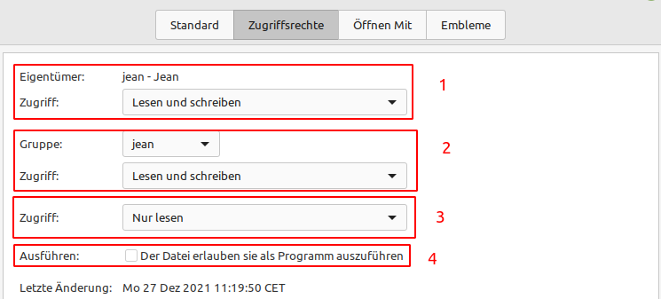

Benutzer und Berechtigungen
===========================

Das Benutzer-, Gruppen- und Berechtigungssystem unter Linux ist sehr tiefgründig.
Ich werde in diesem Kapitel nur die für Sie relevanten Themen behandeln.

Benutzer und Gruppen
--------------------

Im Programm ``Benutzer und Gruppen`` können Sie:

- Ihr Passwort ändern,
- Ihren angezeigten Namen anpassen (rein kosmetisch),
- den Kontotyp zwischen ``Standard`` und ``Systemverwalter`` (Administrator) festlegen,
- weitere Berechtigungen über die Zuweisung zu Gruppen definieren.

Gruppen
^^^^^^^

Durch die Mitgliedschaft in Gruppen können Sie definieren,
was ein Benutzer auf dem System tun darf und was nicht.
Im Linux-Desktop-Bereich wird das Gruppen-Berechtigungssystem allerdings oft stiefmütterlich behandelt
und ist an vielen Stellen obsolet.
Ich gehe daher nur auf die wichtigen Gruppen ein,
die für Sie im Alltag weiterhin relevant sind:

- **cdrom:** Das DVD/CD-Laufwerk darf benutzt werden.
- **lpadmin:** Drucker dürfen verwaltet und eingerichtet werden (drucken können Sie auch ohne diese Gruppe).
- **plugdev:** USB-Sticks, Partitionen und externe Laufwerke können Sie hiermit ein- und aushängen.
- **sambashare:** Ordnerfreigaben dürfen Sie mit Samba erstellen.
- **sudo:** Administrationsrechte (!).
- **nopasswdlogin:** Sie können sich ohne Eingabe des Passworts einloggen.

Gruppen können Sie im Programm ``Benutzer und Gruppen`` für jeden Benutzer einzeln verwalten.
Die anderen verfügbaren Gruppen können Sie als Desktop-Nutzer getrost ignorieren.
Für Server-Administratoren ist dieser Punkt wesentlich spannender.

Administrator (sudo)
^^^^^^^^^^^^^^^^^^^^

Ist ein Benutzer in der Gruppe ``sudo`` eingetragen oder lautet sein Benutzername ``root``,
besitzt er Administrationsrechte.

.. note:: Hintergrundinformationen:
    *In Linux Mint wurde der Benutzer* ``root`` *weitestgehend deaktiviert.*
    *Er existiert daher nicht als eigenständiges Konto.*
    *Sie können sich also nicht direkt als Administrator anmelden,*
    *sondern erhalten als normaler Benutzer über die Gruppe* ``sudo`` *administrative Rechte.*
    *Möchten Sie eine Aktion als Administrator durchführen,*
    *müssen Sie sich explizit mit Ihrem Passwort verifizieren.*
    *(Dafür sind die Programme* ``sudo`` *oder* ``pkexec`` *zuständig)*

Als Administrator können Sie unter anderem folgende Aktionen durchführen:

- Benutzer hinzufügen, entfernen, Gruppen ändern und andere Administratoren verwalten,
- alle Dateien auf dem System einsehen, ändern und löschen (auch die von anderen Benutzern, sofern diese nicht verschlüsselt sind),
- Programme installieren, aktualisieren und deinstallieren,
- das System in jeder Hinsicht anpassen,
- andere Festplatten und installierte Systeme auslesen, verändern oder sogar ausführen.

.. warning::
    Gehen Sie daher nicht leichtfertig mit diesen Rechten um!

    Achten Sie stets darauf,
    wenn Sie während der Nutzung von Linux Mint nach Ihrem Passwort gefragt werden.
    In fast allen Fällen (ausgenommen das Entsperren des Schlüsselbunds oder von SSH-Schlüsseln) wird das Passwort verlangt,
    weil das entsprechende Programm Administrationsrechte benötigt.

Dateirechte
-----------

Für Dateien gibt es unter Linux ein einfaches,
aber effektives Berechtigungssystem.

Eine Datei oder ein Ordner hat einen Eigentümer und eine Gruppe,
der er zugewiesen ist.
Gruppen werden Sie im Alltag höchstwahrscheinlich nicht benötigen.

Grafisch können Sie diese im Dateimanager unter den Dateieigenschaften im Reiter ``Zugriffsrechte`` einstellen.

1. Der Eigentümer einer Datei lässt sich ändern.
   Zudem können Sie definieren,
   was der Besitzer mit der Datei tun darf.
2. Dasselbe gilt für die Gruppe.
   Ich empfehle Ihnen,
   die Gruppe unberührt zu lassen und die gleichen Rechte wie für den Besitzer einzutragen.
3. Hier können Sie die Rechte festlegen,
   die alle anderen Benutzer für diese Datei besitzen.
4. Ist die Datei ein Skript oder ein Programm,
   können Sie hier festlegen,
   dass Sie die Datei als Programm ausführen dürfen.

.. note::
    Die Dateirechte einer Datei oder eines Ordners können nur durch den Besitzer oder einen Administrator geändert werden.

.. warning::
    Standardmäßig können andere Benutzer Ihre Dateien lesen.
    Wenn Sie dies verhindern möchten,
    navigieren Sie aus Ihrem persönlichen Ordner eine Ebene nach oben
    und passen Sie die Dateirechte an,
    wie auf dem Bild unten dargestellt:

    .. image:: images/dateirechte_home.png

    Administratoren können sich jedoch immer Zugriff auf Ihre Dateien verschaffen.