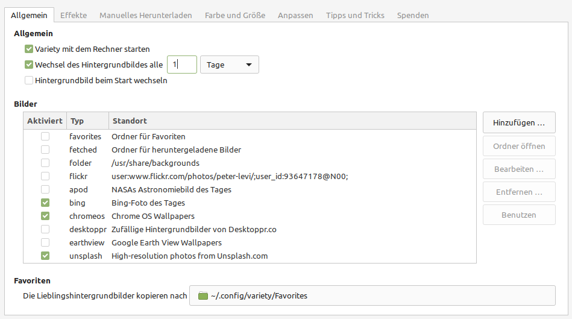
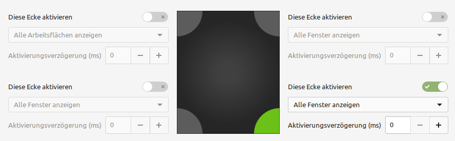

Cinnamon Desktop
================
Unter Linux gibt es viele verschiedene Oberflächen.
Linux Mint nutzt hauptsächlich den eigens entwickelten Desktop *Cinnamon*
In diesem Kapitel werden verschiedene Optimierungen gezeigt, die den Alltag erleichtern.

Hintergrundbild
---------------
In der App ``Hintergrundbilder`` könnnen Sie Ihr gewünschtes Hintergrundbild auswählen.
Unter ``+`` können Sie einen eigenen Ordner hinzufügen, aus dem Bilder hinzugefügt werden können.
Im Reiter Einstellungen können Sie beispieslweise eine Diashow mit allen Bildern aus dem ausgewählten Ordner einrichten.

Variety
^^^^^^^
Das Programm aus der Anwendungsverwaltung lädt automatisch Hintergrundbilder herunter und zeigt beispielsweise das Hintergrundbilder des Tages von Bing.
Die Einstellungen sind vielfältig aber selbstverständlich.

Aktive Ecken
------------
Wenn Sie wollen können Sie beispielsweise unten rechts eine aktive Ecke einrichten:
Wenn Sie dort die Maus hin bewegen können verschiedene Aktionen ausgeführt werden.
Sie können Dies im Programm ``Aktive Ecken`` einrichten.

Uhr mit Datum und/oder Sekunden
-------------------------------
Mit der Anwendung ``Datum und Zeit`` können Sie unter ``Format`` die Uhr rechts unten nach Ihrem Belieben konfigurieren.

Effekte
-------
Möchten Sie die Effekte ausschalten oder anders definieren, können Sie weitreichende Einstellungen in ``Effekte`` treffen.

Tastenkombination für Vollbild
------------------------------
Manchmal ist es praktisch manche Anwendungen manuell in den Vollbildmodus zu bringen.
Um dies einzurichten öffnen Sie das Programm ``Tastatur`` und den Reiter ``Tastenkombinationen``
Wählen Sie ``Fenster`` aus (nicht auf das Dreieck klicken).
Wählen Sie in der rechten Liste ``Vollbildmodus ein-/ausschalten``
Machen Sie einen Doppelklick auf eine nicht zugeordnete Tastenkombination und drücken Sie im Anschluss eine gewünschte Tastenkombination.
Eine gängige Tastenkombination wäre ``Alt`` + ``F11``.

Fenster verschieben
-------------------
Wenn Sie die ``Alt`` Taste gedrückthalten, das Fenster irgendwo mit der Mastaste anklicken und dann die Maus bewegen können Sie das Fenster verschieben.

.. tip:: 
    Sollten Sie das Programm Blender verwenden wird diese Einstellung zum Problem, da Blender die ``Alt`` Taste aktiv belegt.
    Entweder können Sie die Tastenkombinationen in Blender dafür ändern oder sie deaktivieren die Funktion in Cinnamon:
    In der Anwendung ``Fenster`` können Sie unter ``Verhalten`` die ``Sondertaste zum Verschieben und Vergrößern von Fenstern`` definieren.

.. tip:: 
    Fenster können Sie auch in verschiedene Positionen einrasten, indem Sie die ``Super`` (Windows)Taste und eine Pfeiltaste (mehrmals) drücken.
    Probieren Sie es aus!

Arbeitsflächen
--------------
Wie viele andere Desktops bietet Cinnamon auch verschiedene Arbeitsflächen.
Mit ``Alt`` + ``F1`` können Sie die Übersicht dafür öffne und dort neue erstellen oder löschen.
Sie können dafür auch beispielsweise eine aktive Ecke einrichten.

.. tip:: 
    Mit der Tastenkombination ``Alt`` + ``→`` oder ``←`` können Sie zwischen den Arbeitsflächen einfach hin und her wechseln.

Cinnamon neustarten
-------------------
Bei einem Fehler können Sie Cinnamon neustarten, ohne sich neu anzumelden.
Offene Fenster bleiben erhalten.
Drücken Sie dafür ``Alt`` + ``F2``, geben sie ``r`` ein und drücken sie ``Enter``.