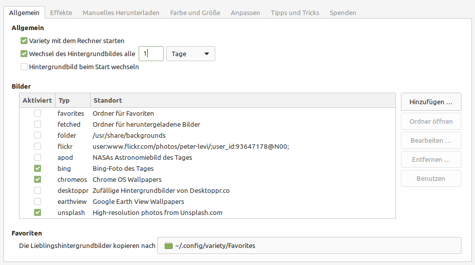
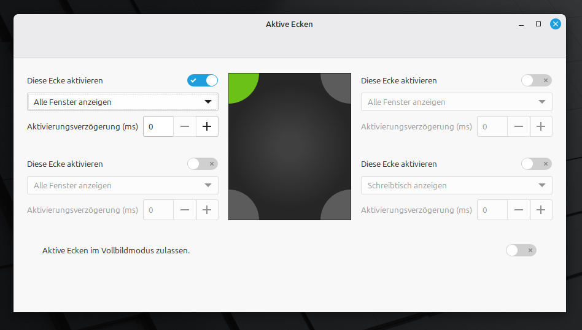

Cinnamon-Desktop
================

Unter Linux gibt es viele verschiedene grafische Oberflächen.
Linux Mint nutzt hauptsächlich den hauseigenen Desktop *Cinnamon*.
In diesem Kapitel zeige ich Ihnen verschiedene Optimierungen,
die Ihren Alltag erleichtern.

Hintergrundbild
---------------

In der Anwendung ``Hintergrundbilder`` können Sie Ihr gewünschtes Hintergrundbild auswählen.
Über das ``+``-Symbol können Sie einen eigenen Ordner hinzufügen,
aus dem Sie Bilder laden möchten.
Im Reiter ``Einstellungen`` können Sie beispielsweise eine Diashow mit allen Bildern aus dem ausgewählten Ordner einrichten.

Variety
^^^^^^^

Ich empfehle Ihnen dafür das Programm **Variety** aus der Anwendungsverwaltung.
Es lädt automatisch Hintergrundbilder herunter und zeigt Ihnen beispielsweise das Hintergrundbild des Tages von Bing.
Die Einstellungen sind vielfältig,
aber weitgehend selbsterklärend.

Aktive Ecken
------------

Wenn Sie möchten,
können Sie beispielsweise unten rechts eine aktive Ecke einrichten:
Sobald Sie die Maus in diese Ecke bewegen,
können verschiedene Aktionen ausgeführt werden.
Sie können dies im Programm ``Aktive Ecken`` konfigurieren.

Hier ein empfohlenes Beispiel:

Uhr mit Datum und/oder Sekunden
-------------------------------

Mit der Anwendung ``Datum und Zeit`` können Sie unter dem Reiter ``Format`` die Uhr rechts unten nach Ihren Wünschen konfigurieren.

Effekte
-------

Möchten Sie die Effekte ausschalten oder anpassen,
können Sie weitreichende Einstellungen im Programm ``Effekte`` vornehmen.

Tastenkombination für Vollbild
------------------------------

Manchmal ist es praktisch,
Anwendungen manuell in den Vollbildmodus zu versetzen.
Um dies einzurichten,
öffnen Sie das Programm ``Tastatur`` und wechseln Sie in den Reiter ``Tastenkombinationen``.
Wählen Sie den Bereich ``Fenster`` aus (klicken Sie dabei nicht auf das Dreieck).
Wählen Sie in der rechten Liste den Eintrag ``Vollbildmodus ein-/ausschalten`` aus.
Führen Sie einen Doppelklick auf eine nicht zugeordnete Tastenkombination aus und drücken Sie im Anschluss die gewünschte Tastenkombination.
Eine gängige Tastenkombination wäre ``Alt`` + ``F11``.

Fenster verschieben
-------------------

Wenn Sie die ``Alt``-Taste gedrückt halten,
das Fenster an einer beliebigen Stelle mit der linken Maustaste anklicken und dann die Maus bewegen,
können Sie das Fenster frei verschieben.

.. tip::
    Sollten Sie beispielsweise das Programm Blender verwenden,
    wird diese Einstellung zum Problem,
    da Blender die ``Alt``-Taste aktiv belegt.
    Entweder können Sie die Tastenkombinationen in Blender ändern,
    oder Sie deaktivieren diese Funktion in Cinnamon:
    In der Anwendung ``Fenster`` können Sie unter ``Verhalten`` die ``Sondertaste zum Verschieben und Vergrößern von Fenstern`` definieren.

.. tip::
    Fenster können Sie auch in verschiedene Positionen einrasten lassen,
    indem Sie die ``Super``-Taste (Windows-Taste) gedrückt halten und eine Pfeiltaste (manchmal auch mehrmals) drücken.
    Probieren Sie es aus!

Arbeitsflächen
--------------

Wie viele andere Desktops bietet Cinnamon auch verschiedene Arbeitsflächen.
Mit der Tastenkombination ``Super`` + ``Tab`` oder über die Übersicht können Sie neue erstellen oder löschen.
Sie können dafür auch beispielsweise eine aktive Ecke einrichten.

.. tip::
    Mit der Tastenkombination ``Alt`` + ``→`` oder ``←`` können Sie bequem zwischen den Arbeitsflächen hin- und herwechseln.

Cinnamon neu starten
--------------------

Sollte ein Fehler auftreten,
können Sie Cinnamon neu starten,
ohne sich abmelden zu müssen.
Ihre geöffneten Fenster bleiben dabei erhalten.
Drücken Sie dafür die Tastenkombination ``Alt`` + ``F2``,
geben Sie ``r`` ein und bestätigen Sie mit ``Enter``.