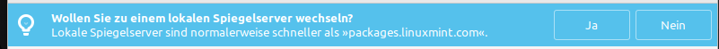

Ersteinrichtung
===============

Bildschirmeinstellungen
-----------------------
Wählen Sie hier die richtige Auflösung aus und klicken Sie unten auf Anwenden.

.. tip:: 
    Sollten Sie die Drei Knöpfe am unteren Rand nicht sehen, 
    können Sie mit der ``Alt`` Taste gedrückt das Fenster zusätzlich mit der Maustaste gedrückt nach oben über den Bildschirm hinaus verschieben.
    Diese Funktion kann in den ``Fenster`` Einstellungen unter ``Verhalten`` konfiguriert werden.

Systemschnappschüsse
--------------------
Starten Sie das Programm ``Timeshift`` und gehen Sie Schritt für Schritt den Konfigurationsassistentn durch.

- Wählen Sie als Schnappschusstyp ``rsync`` aus.
- Wählen Sie als Schnappschussort Ihre Linux Mint-Partition aus. Die Partition sollte über 100 GB groß sein, damit die Schnappschüsse gut funktionieren.
- Als Schnappschussebene wählen Sie Ihre Konfiguration wie im Bild beschrieben aus:

.. figure:: images/timeshift.png

- Im nächsten Fenster lassen Sie die Konfiguration unverändert. Alle Dateien der benutzer sollen ausgeschlossen werden.

Nach dem Info-Dialog sind nun die Systemschnappschüsse konfiguriert. 
Sie können das Programm nun schließen.

Jeden Monat wird nun ein Systemschnappschuss erstellt. 
Die letzten beiden Systemschnappschüsse werden behalten.

.. note:: Hiermit werden keine Persönliche Daten gesichert. Darum werden wir uns später kümmern.

Zusätzliche Treiber
-------------------
Öffnen Sie die ``Treiberverwaltung``. 

Installieren Sie die hier empfohlenen Treiber. 

Sollte das Fenster anzeigen, dass Ihr Rechner keine zusätzlichen Treiber benötigt:
Perfekt! Sie haben hier nichts weiter zu tun.

Aktualisierungsverwaltung:
--------------------------

Updates sind sehr sehr wichtig. Durch diese bleibt der Rechner sicher.
Wenn sich die Aktualisierungsverwaltung noch nicht geöffnet hat, dann können Sie diese bspw. durch das Menü öffnen.

Sollte diese Nachricht bei Ihnen erscheinen, ist empfohlen dies durchzuführen.
Wählen Sie am besten einen Ihnen vertrauten Server aus. Bspw. einen von einer nahegelegenen Universität.

