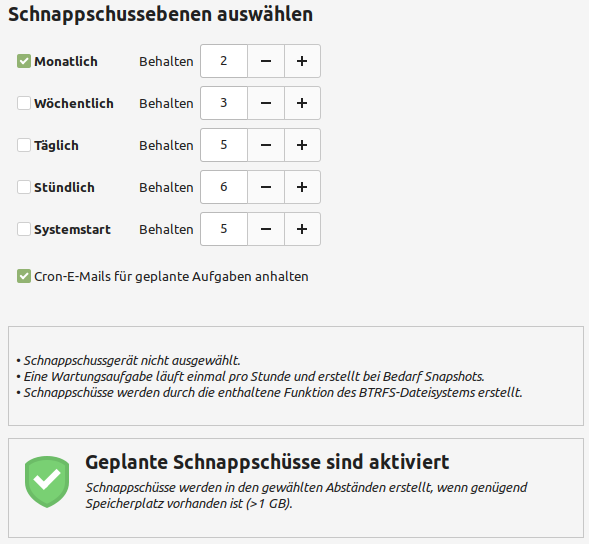

Ersteinrichtung
===============

Bildschirmeinstellungen
-----------------------
Wählen Sie hier die richtige Auflösung aus und klicken Sie unten auf Anwenden.

.. tip:: 
    Sollten Sie die Drei Knöpfe am unteren Rand nicht sehen, 
    können Sie mit der ``Alt`` Taste gedrückt das Fenster zusätzlich mit der Maustaste gedrückt nach oben über den Bildschirm hinaus verschieben.
    Diese Funktion kann in den ``Fenster`` Einstellungen unter ``Verhalten`` konfiguriert werden.

Systemschnappschüsse
--------------------
Starten Sie das Programm ``Timeshift`` und gehen Sie Schritt für Schritt den Konfigurationsassistentn durch.

- Wählen Sie als Schnappschusstyp ``rsync`` aus.
- Wählen Sie als Schnappschussort Ihre Linux Mint-Partition aus. Die Partition sollte über 100 GB groß sein, damit die Schnappschüsse gut funktionieren.
- Als Schnappschussebene wählen Sie Ihre Konfiguration wie im Bild beschrieben aus:

- Test
- Test
