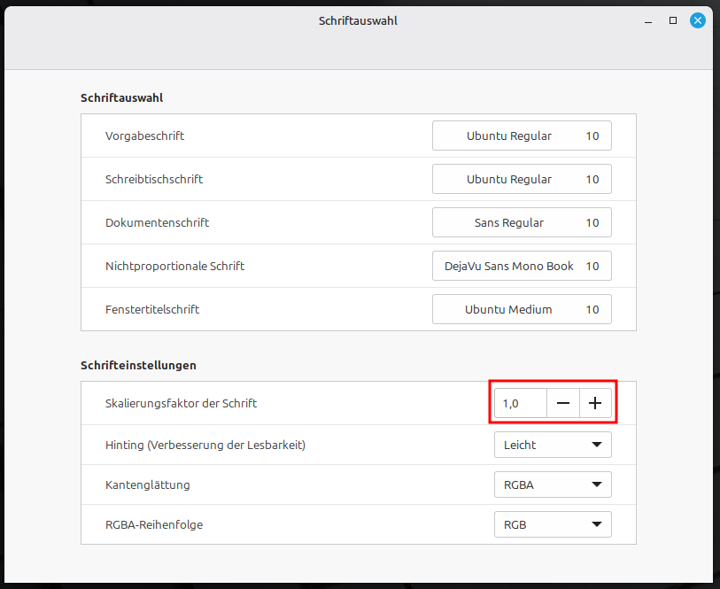
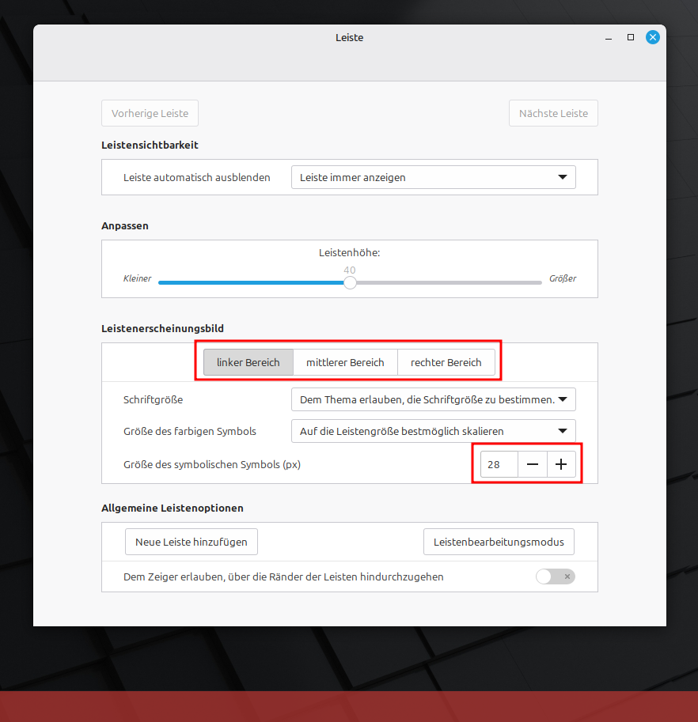
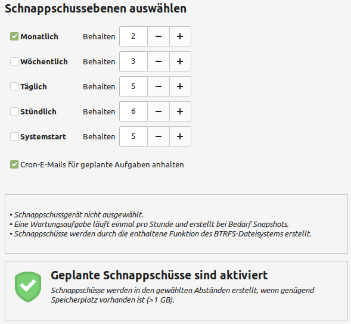
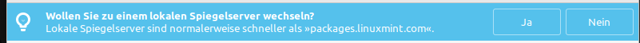

Ersteinrichtung
===============

Bildschirmeinstellungen
-----------------------

Öffnen Sie das Programm ``Bildschirm``.
Wählen Sie hier die richtige Auflösung aus und klicken Sie unten auf ``Anwenden``.

.. tip::
    Sollten Sie die drei Knöpfe am unteren Rand nicht sehen,
    können Sie das Fenster mit gedrückter ``Alt``-Taste und gedrückter linker Maustaste nach oben verschieben.
    Diese Funktion kann in den ``Fenster``-Einstellungen unter ``Verhalten`` konfiguriert werden.

Skalierung der Schrift und der Leiste
*************************************

Sollte die Schrift zu klein dargestellt sein,
empfehle ich Ihnen,
im Programm ``Schriftauswahl`` den Skalierungsfaktor anzupassen.

Die Größe der Leiste unten können Sie per Rechtsklick darauf und die Auswahl von ``Leisteneinstellungen`` (dort unter der Option „Größe des symbolischen Symbols“ – ein kurioser Übersetzungsfehler) anpassen.
Dies müssen Sie sowohl für den linken,
den mittleren als auch den rechten Teil der Leiste durchführen.

Systemschnappschüsse
--------------------

.. note::
    Hiermit werden keine persönlichen Daten gesichert.
    Dies beschreibe ich im Kapitel *Backups*.

Systemschnappschüsse sind eine hervorragende Möglichkeit,
das System im Falle eines Problems wiederherzustellen.
Dennoch benötigt Timeshift unter Linux Mint einiges an Speicherplatz.
Ich empfehle Ihnen,
etwa 100 GB Festplattenspeicher dafür einzuplanen.
Haben Sie diesen Speicherplatz nicht übrig,
empfehle ich Ihnen,
diesen Schritt zu überspringen.

Starten Sie das Programm ``Timeshift`` und gehen Sie Schritt für Schritt den Konfigurationsassistenten durch:

- Wählen Sie als Schnappschusstyp ``rsync`` aus.
- Wählen Sie als Schnappschussort Ihre Linux-Mint-Partition aus.
- Als Schnappschussebene wählen Sie Ihre Konfiguration wie im Bild beschrieben aus:

- Im nächsten Fenster lassen Sie die Konfiguration unverändert. Alle Dateien der Benutzer sollen ausgeschlossen werden.

Nach dem Info-Dialog sind nun die Systemschnappschüsse konfiguriert.
Sie können das Programm nun schließen.

Jeden Monat wird nun ein Systemschnappschuss erstellt.
Die letzten beiden Systemschnappschüsse werden behalten.

Zusätzliche Treiber
-------------------

Öffnen Sie die ``Treiberverwaltung``.
Installieren Sie die hier empfohlenen Treiber.

| Sollte das Fenster anzeigen, dass Ihr Rechner keine zusätzlichen Treiber benötigt:
| Perfekt! Sie haben hier nichts weiter zu tun.

Aktualisierungsverwaltung
-------------------------

Updates sind extrem wichtig,
da sie Ihr System absichern.
Sollte sich die Aktualisierungsverwaltung noch nicht automatisch geöffnet haben,
können Sie diese über das Startmenü starten.

Sollte dieser Hinweis bei Ihnen erscheinen,
empfehle ich Ihnen,
den Wechsel durchzuführen.
Wählen Sie am besten einen nahegelegenen Server aus,
beispielsweise den einer Universität.
Die Server der Hochschule Esslingen sowie der Friedrich-Alexander-Universität Erlangen-Nürnberg haben sich über viele Jahre bewährt.

Nun haben Sie die Wahl:
Entweder kümmern Sie sich wöchentlich selbst um die Updates,
oder Sie lassen diese vollautomatisch durch die Aktualisierungsverwaltung einspielen.
Ich empfehle Ihnen dringend,
die automatischen Updates zu aktivieren.

Wählen Sie dazu in der Aktualisierungsverwaltung ``Bearbeiten -> Einstellungen -> Automatisierung``
und aktivieren Sie dort die entsprechenden Schalter.
Hierbei werden Sie nach Ihrem Passwort gefragt.

.. note::
    Wenn Sie Ihren Rechner herunterfahren wollen, während der Rechner Aktualisierungen durchführt,
    werden Sie im Herunterfahren-Dialog nicht die gewohnten Knöpfe finden.
    Währenddessen ist das Herunterfahren nämlich nicht erlaubt.
    Nach 5 Minuten sollte in der Regel dann wieder der ``Herunterfahren``-Knopf vorhanden sein.

Systemeinstellungen
-------------------

Hier befindet sich die Steuerzentrale von Linux Mint.
Sie bietet eine übersichtliche Struktur aller Systemeinstellungen.
Ich empfehle Ihnen,
bei den aktiven Ecken die linke obere Ecke wie folgt zu konfigurieren:

.. figure:: images/aktive_ecken.png

Damit können Sie alle offenen Fenster überblicken,
zwischen ihnen wechseln oder einzelne Fenster mit einem Klick auf das Mausrad (Mittelklick) schnell schließen.

Firewall
--------

Sollten Sie einen Laptop besitzen,
mit dem Sie ab und zu unterwegs sind,
empfehle ich Ihnen,
die Firewall mit dem Profil ``Öffentlich`` zu aktivieren.

Nutzen Sie Ihren Rechner hingegen ausschließlich zu Hause,
ist das Aktivieren nicht zwingend notwendig,
solange Sie den anderen Geräten in Ihrem Netzwerk vertrauen.
Ihr Internet-Router schützt Sie in der Regel bereits vor Zugriffen von außen.

Sprache
-------

Öffnen Sie den Menüpunkt ``Sprachen``
und wählen Sie ``Sprachen hinzufügen/entfernen``.
Installieren Sie dort gegebenenfalls fehlende Sprachpakete nach.
