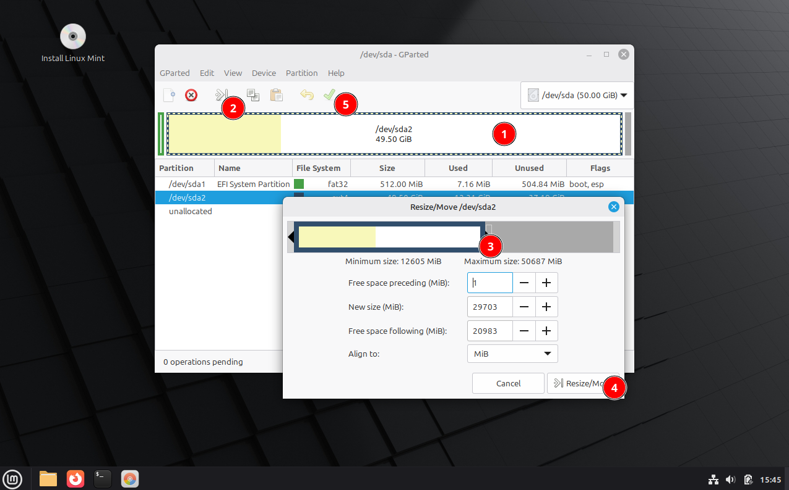
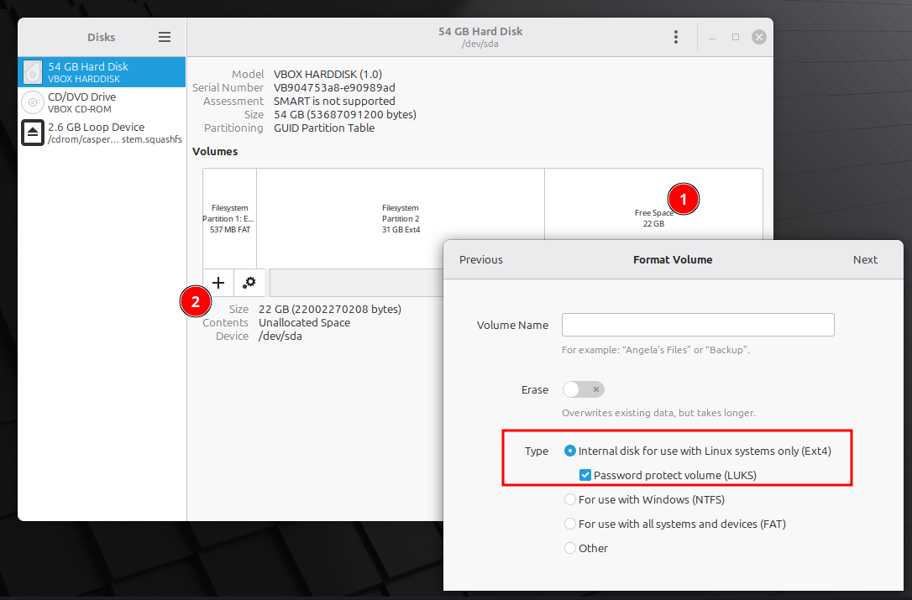
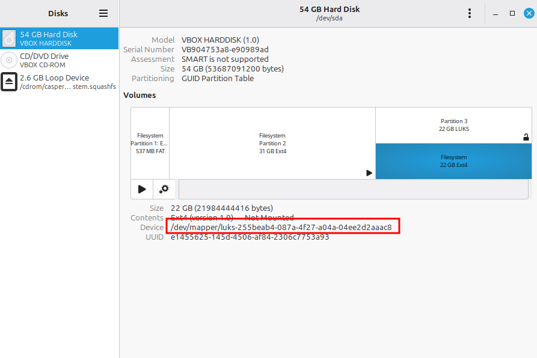
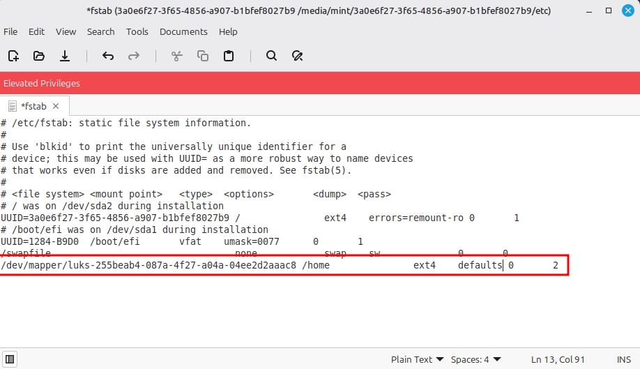
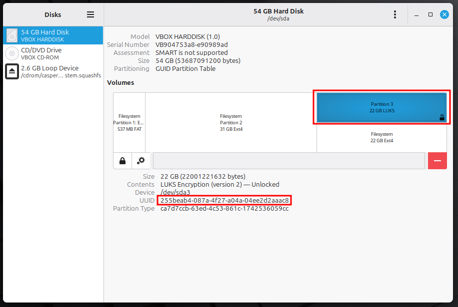
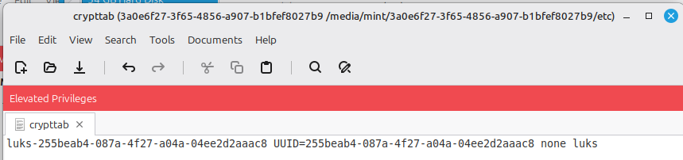
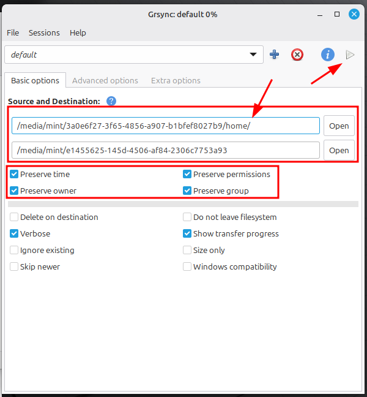
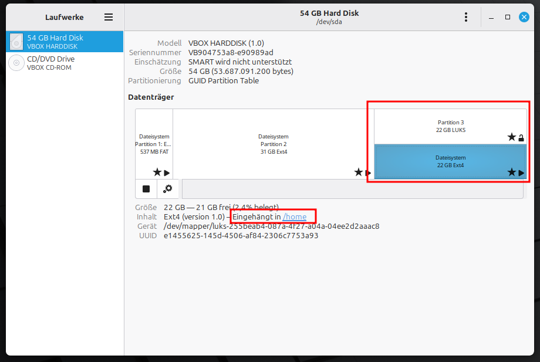

Einfache Installation
=====================

Download
--------

Linux Mint kann von der offiziellen Seite heruntergeladen werden: `https://linuxmint.com/download.php <https://linuxmint.com/download.php>`_. 
Als Download-Server empfiehlt sich unter anderem die Hochschule Esslingen oder die Friedrich-Alexander-Universität Erlangen-Nürnberg, welche seit vielen Jahren sehr zuverlässig funktioneren.
Wird ein sehr neuer Rechner verwendet, haben die Entwickler eine "HWE" (Hardware Enablement) Version zur Verfügung gestellt. 
Diese bitte nur verwenden, wenn die reguläre Version nicht funktioniert, da evtl. andere auf Linux Mint zugeschnittene Treiber eventuell nicht mit dieser neuen Version kompatibel sind.

Bootstick erstellen
-------------------

Hierfür empfiehlt sich das Programm `Etcher <https://www.balena.io/etcher/>`_. 
Ein alternatives Windows-Programm ist `Rufus <https://rufus.ie/>`_, dort unter "Auswahl" die heruntergeladene ISO-Datei auswählen und den Rest auf Standard-Einstellungen belassen.
Eventuelle Fragen über Dateien, die zusätzlich heruntergeladen werden sollen, mit "Ja" beantworten.
Hat man alternativ schon eine Linux Mint Maschine verfügbar, 
kann man dies über das Programm ``USB-Abbilderstellung`` erledigen.

Speicherplatz frei machen
-------------------------

Dies kann man bei Windows über das Programm ``Festplattenpartitionen erstellen`` erledigen.
Bei Linux Mint kann man dies über das Programm ``gparted`` oder über ``Laufwerke`` machen.
Es ist empfohlen, mindestens 50 GB verfügbar zu machen.
Das Erstellen einer Partition auf dem freien Speicherplatz ist nicht nötig. 

.. note:: 
    Wenn man Linux Mint neben Windows installieren möchte, ist empfohlen,
    die beiden Systeme jeweils auf eine eigene Festplatte zu installieren.
    Somit hat Windows weniger "Ausreden", den Linux-Bootloader zu überschreiben.
    Im Zweifelsfall muss man in diesem Parallelbetrieb den Bootloader von Linux Mint wiederherstellen, dies wird im Kapitel über die Problembehebung weiter besprochen.

Installation
------------

Den USB-Stick starten. Sollten Sie Probleme haben, den USB-Stick zu starten, 
suchen Sie im Internet nach Ihrem Laptop-Modell oder Mainboardhersteller und fügen Sie ``von USB-Stick starten`` hinten an.
Gängige Tasten sind: ``ESC``, ``F2``, ``F8``, ``F11``, ``F12``, oder ``Entf``.

.. note:: 
    Sollte es Probleme beim Hochfahren von Linux Mint geben, können Sie beim Starten des USB-Sticks den ``Compatibility`` Modus auswählen.
    Wenn danach die Bildschirmauflösung noch nicht perfekt sein sollte, ist das okay.

Bei der Installation wie gehabt vorgehen. 
Es ist empfohlen, die Multimedia-Codecs zu installieren.

Sollte nach einem Passwort für Secure Boot gefragt werden, empfehle ich, Secure Boot zu deaktivieren, 
da dies später erfahrungsgemäß zu mehr Problemen führt, als dass es die Sicherheit merktlich erhöht.

Sollten Sie wie oben beschrieben freien Speicherplatz geschaffen haben, wählen sie ``Linux Mint daneben installieren`` aus.
Der Rest wird automatich erledigt. Diese Prozedur ist empfohlen, da sie am wenigsten Komplikationen erfordert.

Konfigurieren Sie danach in den restlichen Schritten die Linux Mint Installation nach Ihren Wünschen.

Verschlüsselung
---------------

Bitte wählen Sie bei der Benutzerkonfiguration ``Meinen Persönlichen Ordner verschlüsseln`` nicht aus:
Der Verschlüsselungsmechanismus gilt als nicht mehr sicher und diese Methode zur Verschlüsselung verhindert manch andere Systemfunktionen, wie z.B. das Änderungsdatum/Erstellungsdatum von Dateien korrekt zu speichern.
Ebenfalls ist die Wiederherstellung dieser Daten im Falle eines Systemabsturzes oder einer Neuinstallation nur sehr schwer möglich und kaum dokumentiert.
Nutzen Sie anstattdessen folgende Methode im nächsten Abschnitt.

Verschlüsselung
***************

Im Fenster der Installations-Art gibt es unter "Erweiterte Funktionen..." die Möglichkeit das System zu verschlüsseln.
Diese Option ist vor allem für Laptops mit denen man unterwegs ist, sehr empfehlenswert.

.. tip::
    Bei der Benutzererstellung kann man dann hier auch "Automatische Anmeldung" auswählen, da die Verschlüsselung des Systems bereits einen Passwortschutz bietet.
    Sollte man später beim installierten System gefragt werden, ein Passwort für den  Anmeldeschlüsselbund anlegen, kann man hier getrost das Passwort leer lassen und die Warnung mit "Ignorieren" bestätigen.
    Denn die Passwörter werden sind schon verschlüsselt durch die Systemverschlüsselung abgelegt und müssen daher nicht zwingend noch einmal verschlüsselt werden.
    Damit kann man seinen Laptop nur mit dem Verschlüsselungs-Passwort starten und kann danach direkt mit dem Arbeiten loslegen, ohne weitere Passwörter eingeben zu müssen.

.. warning::
    Bitte wählen Sie bei der Benutzerkonfiguration ``Meinen Persönlichen Ordner verschlüsseln`` nicht aus:
    Der Verschlüsselungsmechanismus gilt als nicht mehr sicher und diese Methode zur Verschlüsselung verhindert manch andere Systemfunktionen, wie z.B. das Änderungsdatum/Erstellungsdatum von Dateien korrekt zu speichern.
    Ebenfalls ist die Wiederherstellung dieser Daten im Falle eines Systemabsturzes oder einer Neuinstallation nur sehr schwer möglich und kaum dokumentiert.

Manuelle Verschlüsselung von /home im Nachhinein (für Fortgeschrittene)
***********************************************************************

Möchte man seine persönlochen Daten im Nachhinein verschlüsseln kann man das wie folgt:

- Starten vom Linux Mint Installations-Stick
- Anstatt ``Install Linux Mint``   ``gparted`` aus dem Menü öffnen und oben rechts das richtige Gerät auswählen
- (Falls wenig freier Speicherplatz vorhanden ist, die persönlichen Daten bspw. auf eine Externe Festplatte auslagern.)
- Die vorhandene Linux Mint Partition verkleinern, empfohlen ist ca. 20 bis 100 GB "Luft" auf der Linux Mint Partition zu lassen, damit man noch weitere Programme, etc. installieren kann.
- Nicht vergessen, in Gparted die Änderungen anzuwenden über den grünen Haken.

- Dann im Programm **Disks** auf den neuen Freien Speicherplatz eine neue Partition erstellen über das ``+``
- Dort Linux-Dateisystem und Passwortverschlüsselung auswählen

- Nach dem anlegen dieser Partition die vorhandene Linux Mint Partition einhängen (in diesem Beispiel die Partition 2)
- Auf dieser Partition die Datei ``/etc/fstab`` als Administrator öffnen und folgende Zeile eintragen: 

``/dev/mapper/luks-XXXXXX /home ext4 defaults 0 2``

(Die luks Code muss exakt dem entsprechen, der in disks unter der folgenden Partition eingeblendet wird:)

- So sollte die Datei am Ende ungefähr aussehen:

- Nun auf der Linux Mint Partition als Administrator eine Datei erstellen die den Pfad ``/etc/crypttab`` hat (neben der fstab Datei) mit folgendem Inhalt:

``luks-XXXXXX UUID=XXXXXXXXXXX none luks``

Dabei ist der luks teil der selbe wie schon oben erwähnt, der UUID Teil ist die UUID der Verschlüsselten "Eltern-Partition" wie im folgenden Bild gezeigt:

Die fertige Crypttab Datei sieht dann in unserem Beispiel folgendermaßen aus:

- Damit sind wir (fast) fertig: Denn jetzt müssen wir die Dateien auf die neue verschlüsselte Partition verschieben. Wir machen das mit dem Programm ``grsync``, welches wir auch auf der Live Sitztung von unserem USB-Linux Mint ganz normal aus der Anwendungsverwaltung installieren können.
  Bevor wir starten, müssen wir sicherstellen, dass beide Partitionen "eingehängt" sind. Das können wir sicherstellen, indem wir in ``Disks`` bei beiden Partitionen jew. den "Play" Knopf neben den Zahnrädern drücken.

  .. figure:: images/DisksPartitionEinhängen.png

- Nun sollten wir grsync wie folgt konfigurieren:

    - Source (erstes Feld): Auf ``Open``, auf ``Other Locations``, dann auf die Linux Mint Festplatte, dort den ``home`` Ordner doppelt klicken, dann ``Open``
    - GANZ WICHTIG: Am Ende des Pfads in dem ersten Feld einen Schrägstrich manuell hinzufügen, das ist wichtig für grsync, sonst wird der Kopiervorgang falsch laufen.
    - Destination (Zweites Feld): Auf ``Open``, auf ``Other Locations``, dann auf die verschlüsselte Festplatte, dann ``Open``
    - Alle Preserve Optionen selektieren
    - Dann auf den grauen Pfeil, jetzt werden die Daten übertragen.

- Nun können wir unser Live Linux Mint USB System wieder herunterfahren und dann unseren Rechner normal starten. Jetzt sollten wir von der Eingabe für die Festplattenverschlüsselung begrüßt werden.

- Wenn alles funktioniert hat, sieht dann in unserem angemeldeten Linux Mint die Festplatten Konfiguration ungefähr so aus, wenn wir das Programm ``Laufwerke`` öffnen:

