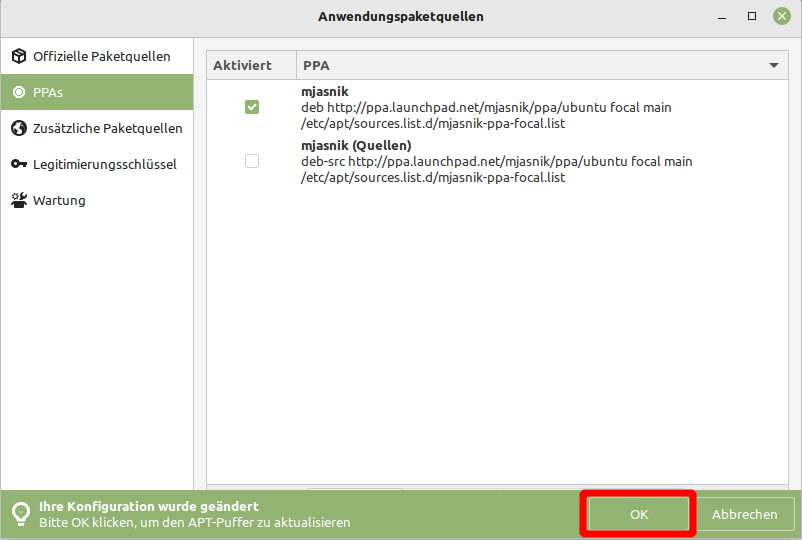
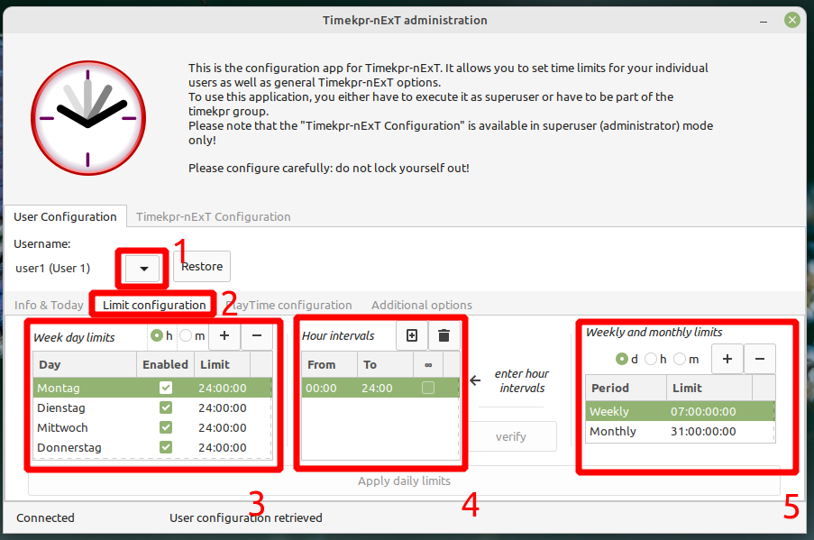
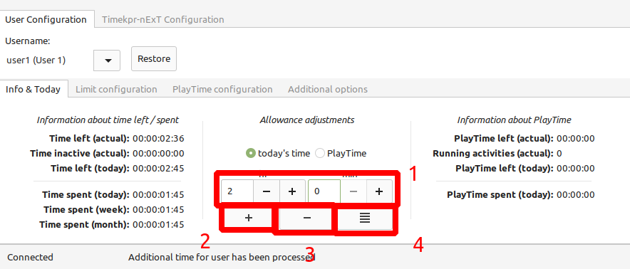

Kindersicherung
===============

Linux Mint kommt leider nicht mit eigenen integrieten Tools, das System für Kinder zu beschränken.

Wir empfehlen für Kinder ein eigenes Linux Mint aufzusetzen, damit Sie selber nicht durch Einschränkungen betroffen sind.

Probleme
--------

Webbrowser
^^^^^^^^^^
Es gibt zwar von Firefox hervorragende Tools, um den Webbrowser für Kinder zu beschränken,
allerdings kann man das Kind nicht davon abhalten,
den ``.mozilla`` versteckten Ordner zu löschen und so den Firefox zurückzusetzen.

Weitere Programme
^^^^^^^^^^^^^^^^^
Eine einfache Blockierung einzelner Anwendungen für einen Benutzer ist leider nicht ganz so einfach.
Stattdessen empfehlen wir solche Anwendungen zu deinstallieren.

Zeiteinschränkung
-----------------
Hier können Sie eine einfache Zeitbeschränkung einstellen. Nach der abgelaufenen Zeit wird der Benuter automatisch abgemeldet und kann sich für den Tag nicht mehr anmelden.
Das Programm ist leider nur in Englisch.

Installation des Programms timekpr
^^^^^^^^^^^^^^^^^^^^^^^^^^^^^^^^^^
Dafür müssen wir das Programm ``timekpr`` aus einer Fremdquelle installieren.

.. warning:: 
    Was eine Fremdquelle ist sollten Sie unbedingt im Kapitel Programme nachlesen.

- Öffnen Sie das Programm ``Anwendungspaketquellen`` wählen das Menü ``PPAs`` und klicken auf ``Hinzufügen``.
- Tragen sie folgende Adresse in die Zeile ein: ``ppa:mjasnik/ppa``
- Bestätigen Sie den Info-Dialog.
- Wenn alles geklappt hat haben Sie eine ähnliche Ansicht, wie im Bild gezeigt. Klicken Sie am Ende auf den markierten ``OK`` Knopf, um den Zischenspeicher zu aktualisieren.

- Öffnen Sie das Programm ``Anwendungsverwaltung``
- Wählen Sie rechts neben der Suche das Burger-Menü (Drei Striche) aus und wählen ``Bitte die Paketliste auffrischen`` aus.
- Suchen Sie nach ``timekpr-next``.
- Installieren Sie die gleichnamige Anwendung.

Einrichtung des Programms
^^^^^^^^^^^^^^^^^^^^^^^^^
- Öffnen Sie im Menü ``Timekpr-nExT administration (Superusermode)``.

.. warning:: 
    Sie können Sich auch selber vom System aussperren! 
    Vergwissern Sie sich, dass Sie sich selber gar keine Limits setzen.

1. Hier wählen Sie den zu bearbeitenden Nutzer aus.
2. Wählen Sie den Reiter ``Limit configuration``
3. Hier können Sie für alle Tage ein Zeit Limit einstellen
4. Für jeden Tag können Sie auch separate Stunden-Intervalle einstellen, von wann bis wann der Nutzer den Rechner nutzen darf. (optional)
5. Insgesamt können Sie auch Wöchtenlicht oder Monatliche Zeit-Limits einstellen wenn sie möchten. (optional)

Klicken Sie am Ende auf ``Apply daily limits`` um die Einstellungen zu übernehmen.

In diesem Programm gibt es noch viele weitere Konfigurationsmöglichkeiten, von diesen wir aber abraten.

Ausnahmen für heutigen Tag
^^^^^^^^^^^^^^^^^^^^^^^^^^
- Öffnen Sie im Menü ``Timekpr-nExT administration (Superusermode)``.
- Wählen Sie wie gehabt den zu bearbeitenden Benutzer und bleiben Sie im ersten Reiter ``Info & Today``

1. Hier können Sie die Zeit in Stunden und Minuten einstellen
2. Möchten Sie die oben definierte Zeit zusätzlich gewähren, drücken Sie einmal auf diesen Knopf
3. Möchten Sie die oben definierte Zeit abziehen, drücken Sie einmal auf diesen Knopf
4. Möchten Sie die oben definierte Zeit als für heute definierte Zeit eintragen, drücken Sie diesen Knopf

- Schließen Sie das Programm, die Änderungen wurden automatisch angewendet.

.. warning:: 
    Damit die Benutzer die Sperre nicht verstellen können, dürfen diese keine Administrationsrechte haben.

Internet-Seiten blockieren
--------------------------
Mit dem Programm ``Mintnanny`` können Sie einzelne konkrete Intersnetseiten für den gesamten Rechner sperren.

Der wohl effektivste Schutz gegen Kinder gefährdete Seiten ist das Erstellen eines neuen Zugangsprofils mit Kindersicherung auf Ihrem Router.
Im Kurs wird dies für die Fritz Box gezeigt.

.. note:: 
    Um den Schutz am Internetrouter nicht zu umgeghen, stellen Sie auch im Standard Profil die Kindersicherung ein.
    Dann sind Versuche, die IP-Adresse zu ändern, zwecklos.

Eine weitere/zusätzliche Möglichkeit wäre ein DNS-Filter. 
Dafür müsste aber sichergestellt werden, dass die DNS-Einstellungen von Linux Mint nicht umgestellt werden dürfen.

Beispiele wären:

-  `Pi-hole <https://pi-hole.net/>`_ 
-  Ohne Einrichtung aber kostenpflichtig: `SafeDNS <https://www.safedns.com/en/safe-internet-at-home/>`_ 

