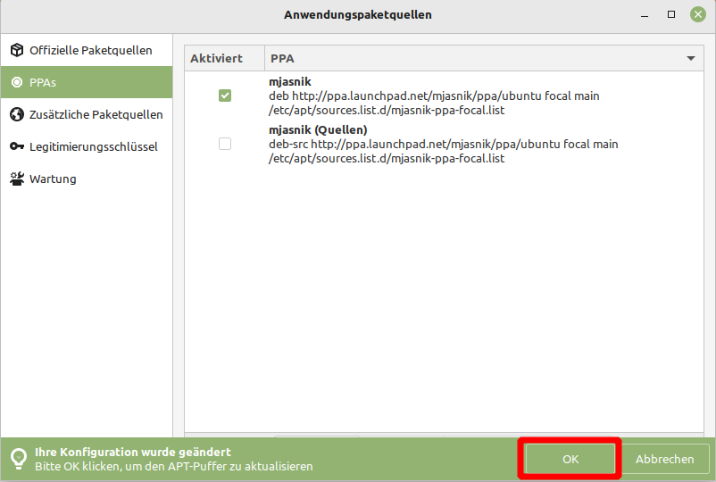
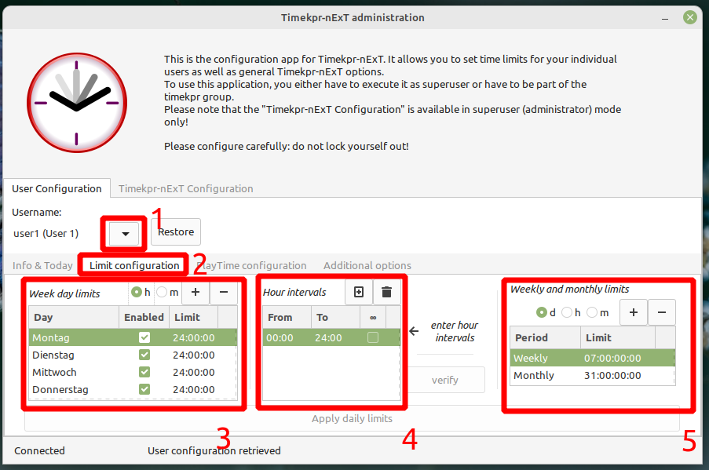
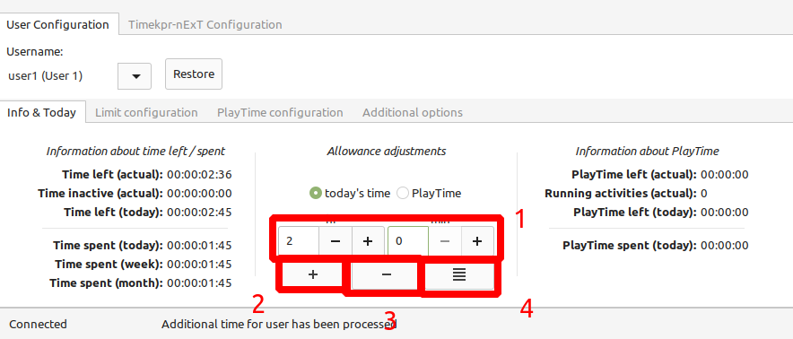

Kindersicherung
===============

Linux Mint bringt standardmäßig leider keine integrierten Werkzeuge mit,
um das System für Kinder einzuschränken.

Ich empfehle Ihnen,
für Ihre Kinder ein eigenes Benutzerkonto oder sogar ein separates Linux Mint aufzusetzen,
damit Sie selbst nicht von den Einschränkungen betroffen sind.

Probleme
--------

Webbrowser
^^^^^^^^^^

Es gibt von Firefox zwar hervorragende Erweiterungen,
um den Webbrowser für Kinder einzuschränken.
Allerdings können Sie Ihr Kind kaum davon abhalten,
den versteckten Ordner ``.mozilla`` zu löschen und Firefox so auf die Standardeinstellungen zurückzusetzen.

Weitere Programme
^^^^^^^^^^^^^^^^^

Eine einfache Blockierung einzelner Anwendungen für einen Benutzer ist leider nicht ganz so leicht umsetzbar.
Stattdessen empfehle ich Ihnen,
solche Anwendungen einfach komplett zu deinstallieren.

Zeiteinschränkung
-----------------

Sie können eine einfache Zeitbeschränkung einrichten.
Nach Ablauf der Zeit wird der Benutzer automatisch abgemeldet
und kann sich für den restlichen Tag nicht mehr anmelden.
Das dafür verwendete Programm ist jedoch leider nur auf Englisch verfügbar.

Installation des Programms timekpr
^^^^^^^^^^^^^^^^^^^^^^^^^^^^^^^^^^

Dafür müssen Sie das Programm ``timekpr`` aus einer Fremdquelle installieren.

.. warning::
    Was eine Fremdquelle ist,
    sollten Sie unbedingt im Kapitel *Programme installieren* nachlesen.

- Öffnen Sie das Programm ``Anwendungspaketquellen``, wählen Sie das Menü ``PPAs`` und klicken Sie auf ``Hinzufügen``.
- Tragen Sie folgende Adresse in die Zeile ein: ``ppa:mjasnik/ppa``
- Bestätigen Sie den Info-Dialog.
- Wenn alles geklappt hat,
  sehen Sie eine ähnliche Ansicht wie auf dem Bild dargestellt.
  Klicken Sie abschließend auf die markierte Schaltfläche ``OK``,
  um den Zwischenspeicher zu aktualisieren.

- Öffnen Sie das Programm ``Anwendungsverwaltung``.
- Wählen Sie rechts neben der Suche das Menü (die drei Striche) und wählen Sie ``Paketliste auffrischen``.
- Suchen Sie in der Anwendungsverwaltung nach ``timekpr-next``.
- Installieren Sie die gleichnamige Anwendung.

Einrichtung des Programms
^^^^^^^^^^^^^^^^^^^^^^^^^

- Öffnen Sie im Menü den Eintrag ``Timekpr-nExT administration (Superusermode)``.

.. warning::
    Sie können sich dabei auch selbst vom System aussperren!
    Rühren Sie am besten Ihr eigenes Benutzerkonto gar nicht an.

1. Hier wählen Sie den zu bearbeitenden Benutzer aus.
2. Wählen Sie den Reiter ``Limit configuration``.
3. Hier können Sie für jeden einzelnen Tag ein Zeitlimit einstellen.
4. Für jeden Tag können Sie auch separate Stundenintervalle festlegen, von wann bis wann der Benutzer den Rechner nutzen darf (optional).
5. Abschließend können Sie wöchentliche oder monatliche Zeitlimits festlegen (optional).

Klicken Sie am Ende auf ``Apply daily limits``, um die Einstellungen zu übernehmen.

In diesem Programm gibt es noch viele weitere Konfigurationsmöglichkeiten,
von deren Nutzung ich Ihnen jedoch abrate.

Ausnahmen für den heutigen Tag
^^^^^^^^^^^^^^^^^^^^^^^^^^^^^^

- Öffnen Sie im Menü den Eintrag ``Timekpr-nExT administration (Superusermode)``.
- Wählen Sie wie gewohnt den zu bearbeitenden Benutzer und bleiben Sie im ersten Reiter ``Info & Today``.

1. Hier können Sie die Zeit in Stunden und Minuten einstellen.
2. Möchten Sie die oben definierte Zeit zusätzlich gewähren, klicken Sie einmal auf diese Schaltfläche.
3. Möchten Sie die oben definierte Zeit abziehen, klicken Sie einmal auf diese Schaltfläche.
4. Möchten Sie die verbleibende Zeit mit dem oben definierten Wert überschreiben, klicken Sie auf diese Schaltfläche.

- Schließen Sie das Programm. Die Änderungen werden sofort angewendet, ohne dass sich der Benutzer neu anmelden muss.

.. warning::
    Damit Benutzer ihre eigene Zeitbeschränkung nicht eigenhändig umgehen können,
    dürfen diese keine Administrationsrechte besitzen.

Internetseiten blockieren
-------------------------

Mit dem Programm ``Mintnanny`` aus der Anwendungsverwaltung können Sie einzelne, konkrete Internetseiten für den gesamten Rechner sperren.

Der effektivste Schutz vor jugendgefährdenden Inhalten ist das Einrichten eines entsprechenden Zugangsprofils mit Kindersicherung direkt auf Ihrem Internet-Router.

.. note::
    Um diesen Schutz am Internet-Router nicht zu umgehen,
    sollten Sie auch für das Standard-Verbindungsprofil Ihrer FRITZ!Box die Kindersicherung aktivieren.
    So sind Versuche, den Filter durch eine Änderung der IP-Adresse zu umgehen, zwecklos.

Eine zusätzliche Möglichkeit bietet ein DNS-Filter.
Dafür müssen Sie jedoch sicherstellen,
dass die DNS-Einstellungen unter Linux Mint vom Benutzer nicht verändert werden können.

Beispiele hierfür sind:

- `Pi-hole <https://pi-hole.net/>`_
- Ohne Einrichtungsaufwand, aber kostenpflichtig: `SafeDNS <https://www.safedns.com/en/safe-internet-at-home/>`_
