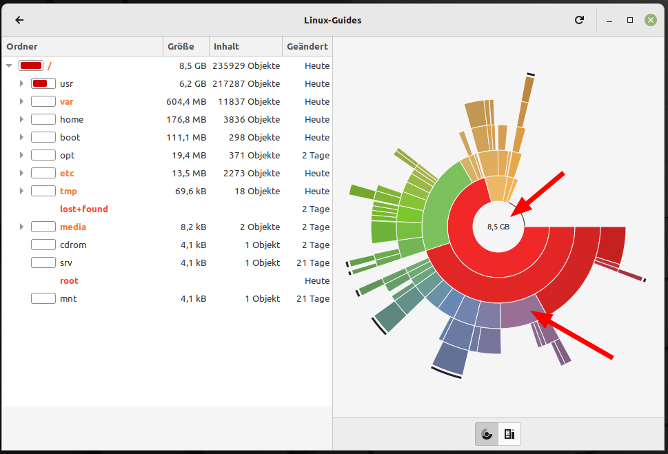

Nützliche Programme
===================

In diesem Kapitel sollen weitere Anwendungen auf Linux Mint vorgestellt werden,
die die Produktivität steigern.

Firefox
-------
Firefox ist einer der besten und sichersten Webbrowser.
Anstattdessen können Sie auch Brave, Chromium, Google Chrome, Opera oder Microsoft Edge installieren.
Doch geben Sie Firefox eine Chance: 
Mit ein paar Einstellungen vereint er Privatspähre, Freiheit und Benutzerfreundlichkeit.

Privatsphäre schützen
^^^^^^^^^^^^^^^^^^^^^
Viele möchten sicher einfach nur ungestört surfen.
Firefox ist einer der wenigen Browser, die von Haus aus viele Privatsphäre-Einstellungen mitbringen.

In den Einstellungen können Sie unter ``Datenschutz & Sicherheit`` den verbesserten Schutz vor Aktivitätenverfolgung auf ``Streng`` stellen.
Zusätzlich empfehlen wir das Addon `uBlock Origin <https://ublockorigin.com/>`_, welches Werbung blockiert.

.. tip::
    Sollte eine Webseite mal nicht so funktionieren,
    wie Sie sich das wünschen können Sie Rechts oben im roten Schild uBlock Origin für diese Webseite ausschalten.
    Den eingebauten Firefox-Schutz können Sie am linken Ende der Adresszeile im Schild für diese Webseite ausstellen.

In den Einstellungen unter ``Suche`` können Sie auch die Standard-Suchmaschine umstellen.
Wir empfehlen ``DuckDuckGo`` oder ``Ecosia``. Dadurch bleiben Ihre Suchanfragen weitestgehend anonym.
``Google`` gewinnt tatsächlich noch aktuell das Rennen in Schnelligkeit und Suchergebnissen, 
dennoch ist die Privatsphäre bei Google nur bedingt gegeben.

.. tip:: 
    Sollten Sie die Lesezeichen-Liste nutzen, empfehlen wir
    unter ``Weitere Werkzeuge -> Symbolleiste anpassen`` unten links
    ``Symbolleisten -> Lesezeichen Symbolleiste`` auf ``Nur bei neuem Tab anzeigen`` einzustellen.

.. note::
    Es besteht die Möglichkeit, sich ein Firefox-Konto zu erstellen und Lesezeichen oder Passwörter mit anderen Geräten zu synchronisieren.

KeePassXC
---------
KeePassXC ist ein großartiger, lokaler Passwortmanager. 
Im Gegensatz zu Cloud-basierten Lösungen werden Ihre Passwörter in einer verschlüsselten Datei auf Ihrem eigenen Rechner gespeichert.

KeePassXC lässt sich einfach aus der Anwendungsverwaltung installieren. 
Um den Komfort zu erhöhen, sollten Sie unbedingt die passende Browser-Erweiterung installieren, 
die ein automatisches Ausfüllen von Zugangsdaten ermöglicht.

Zusätzlich bietet KeePassXC mächtige Zusatzfunktionen:
- **TOTP:** Sie können direkt Zwei-Faktor-Authentifizierungscodes (Time-based One-Time Passwords) in KeePassXC generieren lassen, was separate Authenticator-Apps überflüssig macht.
- **SSH-Keys:** Für die fortgeschrittenen unter uns: KeePassXC verfügt über einen integrierten SSH-Agenten. Ihre SSH-Schlüssel können sicher in der Datenbank verwahrt und bei Bedarf automatisch bereitgestellt werden.

.. warning::
    - Verwenden Sie Passwörter niemals doppelt!
    - Da die Datenbank lokal liegt, sind Sie selbst für regelmäßige Backups der `.kdbx`-Datei verantwortlich.
    - Verwenden Sie ein starkes Master-Passwort, da dieses der einzige Schutz für all Ihre Daten ist.

Warpinator
----------
Mit diesem Programm können Sie sehr einfach Dateien im lokalen Netzwerk verschicken.
Das Programm gibt es für Linux und Android.

.. note:: 
    Hat man die Firewall aktiv, kann man in den Warpinator Einstellungen die Firewallregeln aktualisieren:

    .. image:: images/warpinator_firewall.png
    

USB-Stick Formatierung
----------------------
Auf Linux Mint sind die Programme ``USB-Stick-Formatierer`` und ``USB-Abbilderstellung`` bereits vorinstalliert.

Mit der USB-Abbilderstellung können Sie beispieslweise ``.iso`` Dateien auf einen USB-Stick schreiben.
Damit können Sie dann auf anderen Rechnern bspw. Linux installieren.

Laufwerke
---------
Mit diesem Programm können Sie Partitionen auf Ihrer Fesplatte bearbeiten und bspw. verschiedene Einhängeoptionen vornehmen.

Pix
---
Mit Pix lassen sich Fotos aus dem Handy oder der SD-Karte importieren und einfache Bearbeitungen vornehmen.
Wollen Sie Fotos genauer bearbeiten gibt es dafür die Programme ``Darktable``, ``GIMP`` oder für Einsteiger ``Pinta``.

Systemüberwachung
-----------------
Das Pendant dazu auf Windows ist der Taskmanager.
Über die Systemüberwachung können Sie Prozesse beenden, sollte einer sich aufhängen.
Im Reiter ``Ressourcen`` finden Sie verschiedene Diagramme, die den aktuellen Verbrauch
von Arbeitsspeicher, der Internetverbindung und die Auslastung der Prozessor-Kerne zeigen.

Festplattenbelegungsanalyse
---------------------------

Mit dem Programm kann man sehr einfach seine Festplattenbelegung sehen.
Klickt man auf einen Ringabschnitt, navigiert man in den Ordner.
Möchte man wieder den übergeordneten Ordner ansehen, kann man in die Mitte des Diagramms klicken.

Ihre Wissensdatenbank
---------------------

Egal, was Sie an Ihrem Computer oder auf Ihrer Arbeit erledigen: Das Schreiben eigener Anleitungen ist langfristig für die Produktivität essentiell.

Hierfür empfiehlt sich die Nutzung von **Obsidian**, was leider aktuell nicht Open Source ist, dennoch sehr offene Formate nutzt.
Da Obsidian alle Notizen als simple `.md` (Markdown) Dateien in einem normalen Ordner auf der Festplatte speichert, 
ist das Format extrem zukunftssicher und flexibel. 

.. tip:: 
    Durch das standardisierte Markdown-Format ist Obsidian hervorragend kompatibel mit **Nextcloud Notes**. 
    Wenn Sie Ihren Notizen-Ordner über Nextcloud synchronisieren, 
    können Sie Ihre Wissensdatenbank problemlos auf all Ihren Geräten (auch unter Android) nutzen und bearbeiten.

Bildschirmfoto
--------------
Mit diesem Programm können Sie einfach Screenshots erstellen.

1. Mit ``Druck`` können Sie einen Screenshot von der gesamten Bildschirmfläche erstellen.
2. Mit ``Alt`` + ``Druck`` können Sie einen Screenshot vom aktuellen Fenster erstellen.
3. Mit ``Shift`` + ``Druck`` können Sie eigenen Bildschirmbereich festelegen, der abfotografiert werden soll.

Möchten Sie erweitere Screenshots erstellen, empfehlen wir das Programm ``Flameshot`` aus der Anwendungsverwaltung.
