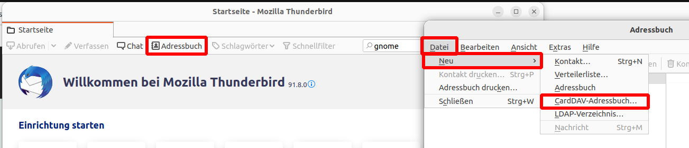

Onlinekonten
============

Onlinekonten erlauben es, den Kalender, Dateien, Kontakte und mehr mit einer Cloud zu synchronisieren.

Mögliche Kandidaten wären:

- Nextcloud (empfohlen)
- Google
- Microsoft
- Dropbox

Im Kurs wird gezeigt, wie man einen Nextcloud Account auf seinem Rechner hinzufügt und diesen komplett ausreizt.
Auf Wunsch kann dies stattdessen auch mit einem anderen Dienst gemacht werden.

Nextcloud
---------

Nextcloud ist eine freie kollaborative Cloud, die man in Eigenregie hosten kann, oder bei einigen Anbietern (wie beispielsweise: bei `Libre Workspace Cloud <https://www.libre-workspace.org/cloud/>`_*  oder `Ionos <https://www.ionos.de/office-loesungen/managed-nextcloud-hosting#pakete>`_) mieten kann.

Möchte man sein Nextcloud-Konto zu Linux Mint hinzufügen, kann man dies in dem Programm ``Internetkonten`` erledigen.
Wichtig ist, die Serveradresse beispielsweise so einzutragen: ``https://cloud.example.com/``.
Bei manchen Nextcloud Konten muss man dafür ein extra App-Passwort erstellen, das kann in der Nextcloud unter ``Persönlichen Einstellungen`` -> ``Sicherheit`` -> ``Geräte und Sitzungen`` erledigt werden.
Danach werden automatisch alle Kalender, Adressbücher und Dateien unter Linux Mint verfügbar gemacht.

.. tip:: 
    Möchte man auf das Adressbuch zugreifen, muss man dafür die Anwendung ``gnome-contacts`` aus der Anwendungsverwaltung installieren.

*\*) Schamlose Eigenwerbung*

Nextcloud-Client
^^^^^^^^^^^^^^^^

Es ist empfohlen, für die Datei-Synchonisation den Nextcloud Desktop Client zu installieren.
Die App heißt ``nextcloud-desktop`` in der Anwendungsverwaltung.

Die Anmeldung und Einrichtung sollte selbsterklärend sein.

.. tip:: 
    Nach der Einrichtung ist es empfohlen, unter ``Startprogramme`` den Nextcloud Client hinzuzufügen. Damit wird beim Anmelden der Synchisations-Client direkt gestartet.

Thunderbird
-----------

Thunderbird ist eines der besten Mail-Programme. Wenn Sie es bis jetzt nicht kennen, geben Sie Thunderbird eine Chance!

.. note:: 
    Um Ihre Mail-Adresse hinzuzufügen, müssen Sie sicherstellen, dass bei Ihrem Mail-Account die IMAP und SMTP Option aktiviert sind.
    Das können Sie in der Regel bei Ihrem Mail-Anbieter unter 'Sicherheit' oder 'Drittanbieter Apps' einstellen.

Das Hinzufügen eines neuen Mail-Kontos zu Thunderbird ist selbsterklärend.

Adressbuch der Nextcloud nutzen
^^^^^^^^^^^^^^^^^^^^^^^^^^^^^^^

- Öffnen Sie wie im Bild gezeigt den "Hinzufügen"-Dialog.
- Tragen Sie Ihren Nextcloud-Benutzernamen und die Adresse Ihrer Nextcloud ein. Beispiel: ``https://cloud.example.com/``
- Geben Sie das Passwort Ihres Nextcloud-Kontos im nächsten Dialog ein.
- Im letzten Dialog können Sie die Adressbücher auswählen. Es wird empfohlen, ``Zuletzt kontaktiert`` abzuwählen. Klicken Sie daraufhin auf ``Weiter``. 
- Ihr Adressbuch wurde nun hinzugefügt.

