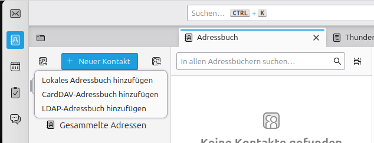

Onlinekonten
============

Onlinekonten erlauben es Ihnen, Ihren Kalender, Ihre Dateien, Kontakte und mehr mit einer Cloud zu synchronisieren.

Mögliche Dienste sind:

- Nextcloud (empfohlen)
- Google
- Microsoft
- Dropbox

Im Kurs zeige ich Ihnen,
wie Sie ein Nextcloud-Konto auf Ihrem Rechner hinzufügen und dieses vollumfänglich nutzen.
Auf Wunsch können Sie dies stattdessen auch mit einem anderen Dienst durchführen.

Nextcloud
---------

Nextcloud ist eine freie, kollaborative Cloud,
die Sie in Eigenregie hosten oder bei verschiedenen Anbietern
(wie beispielsweise bei `Libre Workspace Cloud <https://www.libre-workspace.org/cloud/>`_\* oder `Ionos <https://www.ionos.de/office-loesungen/managed-nextcloud-hosting#pakete>`_) mieten können.

Wenn Sie Ihr Nextcloud-Konto zu Linux Mint hinzufügen möchten,
können Sie dies im Programm ``Internetkonten`` tun.
Achten Sie darauf,
die Serveradresse in folgendem Format einzutragen: ``https://cloud.example.com/``.
Bei manchen Nextcloud-Konten müssen Sie dafür ein separates App-Passwort erstellen.
Dies können Sie in der Nextcloud-Oberfläche unter ``Persönliche Einstellungen -> Sicherheit -> Geräte und Sitzungen`` tun.
Danach werden automatisch all Ihre Kalender, Adressbücher und Dateien unter Linux Mint verfügbar gemacht.

.. tip::
    Wenn Sie direkt auf das Adressbuch zugreifen möchten,
    müssen Sie die Anwendung ``gnome-contacts`` aus der Anwendungsverwaltung installieren.

.. note::
    \* ) Schamlose Eigenwerbung.

Nextcloud-Client
^^^^^^^^^^^^^^^^

Ich empfehle Ihnen,
für die Dateisynchronisation den Nextcloud Desktop Client zu installieren.
Die App heißt ``nextcloud-desktop`` in der Anwendungsverwaltung.

Die Anmeldung und Einrichtung sollte selbsterklärend sein.

.. tip::
    Nach der Einrichtung empfehle ich Ihnen,
    unter ``Startprogramme`` den Nextcloud Client hinzuzufügen.
    Dadurch startet der Synchronisations-Client bei jeder Anmeldung automatisch.

Thunderbird
-----------

Thunderbird ist eines der besten E-Mail-Programme.
Wenn Sie es bisher noch nicht kennen,
empfehle ich Ihnen,
Thunderbird eine Chance zu geben!

.. note::
    Um Ihre E-Mail-Adresse hinzuzufügen,
    müssen Sie sicherstellen,
    dass bei Ihrem E-Mail-Account die IMAP- und SMTP-Optionen aktiviert sind.
    Das können Sie in der Regel bei Ihrem E-Mail-Anbieter unter „Sicherheit“ oder „Drittanbieter-Apps“ einstellen.

Das Einrichten eines neuen E-Mail-Kontos in Thunderbird ist weitgehend selbsterklärend.

Adressbuch der Nextcloud nutzen
^^^^^^^^^^^^^^^^^^^^^^^^^^^^^^^

- Öffnen Sie wie auf dem Bild gezeigt den „Hinzufügen“-Dialog.
- Tragen Sie Ihren Nextcloud-Benutzernamen und die Adresse Ihrer Nextcloud ein. Beispiel: ``https://cloud.example.com/``
- Geben Sie das Passwort Ihres Nextcloud-Kontos im nächsten Dialog ein.
- Im letzten Dialog können Sie die Adressbücher auswählen.
  Ich empfehle Ihnen,
  ``Zuletzt kontaktiert`` abzuwählen und bei ``Geburtstage`` die Option ``Schreibgeschützt`` auszuwählen.
  Klicken Sie daraufhin auf ``Weiter``.
- Ihr Adressbuch wurde nun hinzugefügt.
