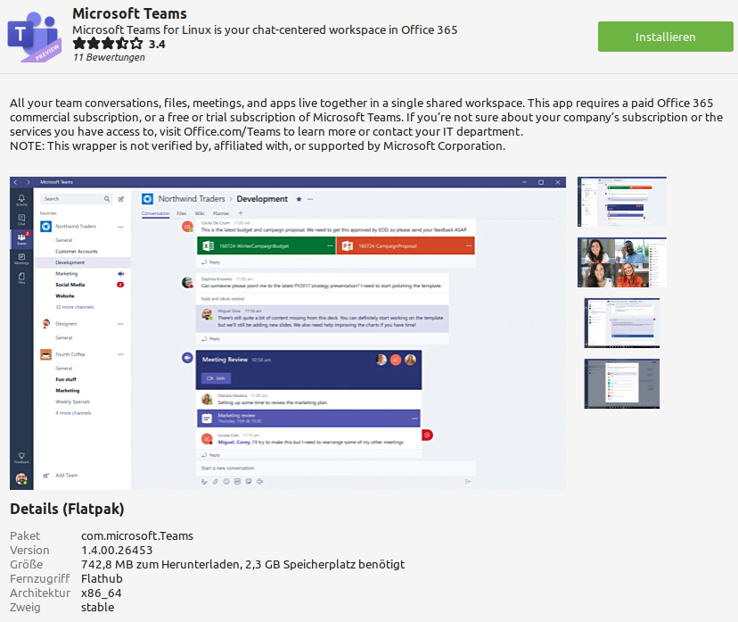

Programme installieren
======================

Anwendungsverwaltung
--------------------
Diese sollte die erste Anlaufstelle sein, wenn man Anwendungen installieren möchte. 
Die Beschreibung ist dennoch meist ganz aufschlussreich.

Beispiel Microsoft Teams:
^^^^^^^^^^^^^^^^^^^^^^^^^

Wenn man sich den Beschreibungstext durchliest, erfahren wir, 
dass diese Ausführung nicht offiziell von Micorosoft unterstützt wird.
Das heißt, Dritte stellen das Programm zur Verfügung.
Sollten also während der Benutzung Fehler auftreten, 
könnte das auf diesen Sachverhalt zurückzuführen sein.

Generell spricht nichts gegen die Verwendung von solchen Ausführungen,
man sollte es aber im Hinterkopf behalten, dass das eine inoffizielle Ausführung ist.

Möchte man hingegen die offizielle Version installieren,
werden Details dazu im nächsten Abschnitt ``.deb Dateien aus dem Internet`` beschrieben.

Flatpaks:
^^^^^^^^^
Aus dem Screenshot im zuvorigen Abschnitt kann man unter Details das Wort ``Flatpak`` entnehmen.
Flatpaks sind eine neue Art, auf Linux Programme zu installieren.

Flatpaks haben den Vorteil, dass sie auf jedem Linux laufen sollen und in der Regel top aktuelle Versionen eines Programms bieten.
Dazu laufen sie in ihrem eigenen kleinen "Linux", auch Sandkasten genannt.
Allerdings können so bei manchen Flatpaks Kompatibilitäts-Probleme im Zusammenspiel vorallem mit anderen Programmen auftreten,
da diese nicht in die kleinen "Sandkästen" herein oder aus ihren eigenen heraus kommen.

Dies bringt eine neue Sicherheitsschicht mit sich: Durch diese kann man kontrollieren, 
was ein Flatpak-Programm auf dem System machen darf.

.. tip:: 
    Manchmal findet man bei der Dateiauswahl nicht die gewünschte Dateien oder Ordner. Dies kann darauf hinweisen, 
    dass das Flatpak keine Berechtigungen hat, auf alle Dateien zuzugreifen.
    Durch die Anwendung ``Flatseal`` kann man die unter anderem die Dateiberechtigungen für einzelne Flatpak-Anwendungen einstellen und ändern.

.. warning:: 
    Auch wenn die Flatpak-Anwendungen eine neue Sicherheitsschicht haben, kann diese durch bösartige Anwendungen umgangen werden.
    Hat es eine Anwendung also abgesehen, aus dieser Schicht auszubrechen, kann sie das zu einem gewissen Grad tun.
    Man sollte sich hier nicht in kompletter Sicherheit wiegen.