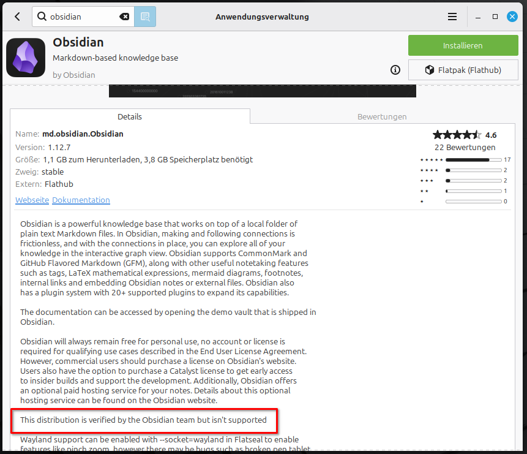

Programme installieren
======================

Anwendungsverwaltung
--------------------

Die Anwendungsverwaltung sollte Ihre erste Anlaufstelle sein,
wenn Sie Anwendungen installieren möchten.
Die dortigen Beschreibungen sind meist aufschlussreich und hilfreich.

Beispiel Obsidian:
^^^^^^^^^^^^^^^^^^

Wenn Sie sich den Beschreibungstext aufmerksam durchlesen,
erfahren Sie,
dass diese Version nicht offiziell von den Entwicklern unterstützt wird.
Sollten also während der Benutzung Fehler auftreten,
kann dies auf diesen Sachverhalt zurückzuführen sein.

Flatpaks
^^^^^^^^

Aus den Details im vorherigen Abschnitt können Sie entnehmen,
dass es sich um ein Flatpak handelt.
Flatpak ist eine moderne Technologie,
um Programme unter Linux zu installieren und isoliert auszuführen.

Flatpaks haben den Vorteil,
dass sie auf fast jeder Linux-Distribution laufen und in der Regel sehr aktuelle Programmversionen bieten.
Dazu laufen sie in ihrer eigenen, geschützten Umgebung (auch Sandkasten genannt).
Allerdings können bei manchen Flatpaks Kompatibilitätsprobleme im Zusammenspiel mit anderen Programmen auftreten,
da diese nicht in die geschützten Umgebungen hinein- oder aus ihnen herauskommen.

Dies bringt eine neue Sicherheitsschicht mit sich:
Durch sie können Sie kontrollieren,
was eine Flatpak-Anwendung auf dem System tun darf.

.. tip::
    Manchmal finden Sie bei der Dateiauswahl nicht die gewünschten Dateien oder Ordner.
    Dies kann darauf hinweisen,
    dass das Flatpak keine Berechtigung besitzt, auf das restliche Dateisystem zuzugreifen.
    Mithilfe der Anwendung **Flatseal** können Sie unter anderem die Dateiberechtigungen für einzelne Flatpak-Anwendungen anpassen.

.. warning::
    Auch wenn Flatpak-Anwendungen eine zusätzliche Sicherheitsschicht besitzen,
    kann diese von bösartigen Anwendungen umgangen werden.
    Ist eine Anwendung darauf ausgelegt,
    aus dieser Umgebung auszubrechen,
    kann sie dies bis zu einem gewissen Grad tun.

.deb-Dateien aus dem Internet
-----------------------------

Manchmal kann es sinnvoll sein,
auf die Programme aus der Anwendungsverwaltung zu verzichten
und stattdessen die offizielle Version direkt vom Entwickler zu installieren.

.. warning::
    Achten Sie unbedingt auf die Quelle der ``.deb``-Datei.
    Installieren Sie bitte ausschließlich Pakete von offiziellen Herstellerseiten.
    Eine ``.deb``-Datei besitzt vollständige Systemrechte:
    Das Zerstören des gesamten Systems,
    der Wiederherstellungspunkte und all Ihrer persönlichen Dateien kann andernfalls die Folge sein.

**Sollte the .deb-Version der Herstellerseite keine nennenswerten Vorteile bieten,
rate ich Ihnen dringend von der Installation ab,
da das Sicherheitsrisiko für Ihr System extrem hoch sein kann.**

Für manche Anwendungen ist eine ``.deb``-Version jedoch unumgänglich.
Ein Beispiel hierfür ist Softmaker Office.

Um eine ``.deb``-Datei zu installieren,
müssen Sie diese lediglich herunterladen,
per Doppelklick öffnen und auf ``Paket installieren`` klicken.

AppImages
---------

AppImages sind spezielle, tragbare Programmdateien:
Sie enthalten alles, was eine Anwendung zum Ausführen benötigt.
Eine Installation im System ist nicht nötig.
Es reicht aus, das AppImage in einen Ordner (beispielsweise „Programme“ in Ihrem persönlichen Verzeichnis) zu verschieben
und die Datei in den Dateieigenschaften als ausführbar zu markieren (siehe Kapitel *Benutzer und Berechtigungen*).
Danach können Sie das Programm durch einen Doppelklick auf die AppImage-Datei starten.

.. tip::
    Ich empfehle Ihnen,
    das Programm **Gear Lever** aus der Anwendungsverwaltung zu installieren.
    Damit lassen sich AppImages extrem komfortabel verwalten und in Ihr Linux-Mint-Startmenü integrieren.

.. note::
    AppImages aktualisieren sich in der Regel nicht automatisch.
    Sicherheitsrelevante Anwendungen nutzen dieses Format daher in der Regel nicht.

Fremdquellen (PPAs)
-------------------

Manche Anwendungen finden Sie nicht in der Anwendungsverwaltung.
Anstatt manuell ``.deb``-Dateien zu installieren,
bieten viele Entwickler sogenannte *Personal Package Archives* (PPAs) oder andere Fremdquellen an.
Der Vorteil hierbei ist,
dass die installierten Programme automatisch über die Systemaktualisierung Updates erhalten.

.. note::
    Einige ``.deb``-Dateien richten bei ihrer Installation automatisch eine passende Fremdquelle ein,
    damit die Anwendung künftige Updates erhält.
    Google Chrome verhält sich beispielsweise so.

Mit dem Programm ``Anwendungspaketquellen`` können Sie PPAs und weitere Fremdquellen einsehen und konfigurieren.

Haben Sie eine neue Fremdquelle hinzugefügt,
finden Sie die entsprechenden Anwendungen nach dem Aktualisieren des Zwischenspeichers in der Anwendungsverwaltung.

.. note::
    Dafür müssen Sie in der Anwendungsverwaltung im Menü rechts neben der Suche die Option ``Paketliste auffrischen`` auswählen.

.tar.gz- oder .zip-Dateien
--------------------------

Manchmal bieten Entwickler ihre Programme nur als gepacktes Archiv (``.tar.gz`` oder ``.zip``) an.
Dies geschieht sehr selten und wird Ihnen im regulären Linux-Alltag kaum begegnen.

Entpacken Sie solche Archive.
Meist finden Sie darin eine ausführbare Datei (oft ohne Dateiendung),
die Sie starten können.

.. tip::
    Sie können in den Menüeinstellungen einen neuen Eintrag für das Programm anlegen,
    sodass Sie es wie gewohnt über das Startmenü starten können.

Sollten Sie keine ausführbare Datei finden
und stattdessen eine Datei mit dem Namen ``Makefile`` vorliegen haben,
müssen Sie das Programm erst kompilieren, dies werden wir hier nicht weiter besprechen.

Windows-Anwendungen unter Linux
-------------------------------

Der Umstieg auf Linux Mint wirft oft die Frage auf,
wie Sie gewohnte Windows-Programme (``.exe``-Dateien) weiter nutzen können.
Es gibt dafür verschiedene technische Wege,
Windows-Software auf Linux auszuführen:

* **Wine (nativ):**
  Wine ist kein Emulator, sondern eine Kompatibilitätsschicht, die Windows-Systemaufrufe direkt in Linux-Befehle übersetzt.
  Dadurch laufen viele Windows-Programme ohne Windows-Betriebssystem direkt auf Ihrem Desktop.

* **Bottles:**
  Dieses Werkzeug basiert auf Wine und macht die Verwaltung deutlich einfacher.
  In Bottles können Sie isolierte Umgebungen („Flaschen“) für verschiedene Programme anlegen,
  sodass sich verschiedene Anwendungen nicht gegenseitig stören.
  Zudem lassen sich benötigte Windows-Bibliotheken (DLLs) bequem per Mausklick nachinstallieren.

* **Proton:**
  Diese von Valve entwickelte Wine-Variante ist direkt in Steam integriert.
  Sie ist stark auf 3D-Grafik optimiert und sorgt dafür, dass tausende Windows-Spiele unter Linux auf Knopfdruck laufen.

* **Windows in VirtualBox (Virtualisierung):**
  Hierbei installieren Sie über das Programm **VirtualBox** ein vollständiges, virtuelles Windows in einem Fenster unter Linux Mint.
  Die Windows-Software läuft dann in ihrer gewohnten Originalumgebung.

Die Probleme mit Wine, Bottles und Proton
^^^^^^^^^^^^^^^^^^^^^^^^^^^^^^^^^^^^^^^^^

Die Erfolgsquote beim Ausführen von Windows-Programmen über Übersetzungsschichten ist extrem schwankend.
Während manche Anwendungen sofort funktionieren,
erfordern viele andere einen enormen Konfigurationsaufwand.
Zudem besteht immer das Risiko,
dass Updates der Windows-Anwendung das mühsam konfigurierte Setup von heute auf morgen unbrauchbar machen.

Linux-Alternativen nutzen
^^^^^^^^^^^^^^^^^^^^^^^^^

Kaum ein langjähriger Linux-Nutzer betreibt im Alltag noch Windows-Programme.
Das Ziel sollte immer sein,
langfristig auf native Linux-Alternativen umzusatteln.
Diese laufen stabiler,
verbrauchen weniger Ressourcen und machen bei System-Updates keinen Ärger.
Um passende Programme zu finden,
hilft Ihnen die Webseite `AlternativeTo.com <https://alternativeto.net/>`_.
Geben Sie dort einfach das gewohnte Windows-Programm ein und filtern Sie die Ergebnisse nach „Linux“.

Sollte es für eine Software (z. B. ein spezielles Steuer- oder Buchhaltungsprogramm) absolut keine Linux-Alternative geben,
ist die Virtualisierung mit **VirtualBox** die stabilste Lösung.
Da dort ein echtes Windows läuft,
funktionieren die Programme und deren Updates garantiert.
Dieser Weg eignet sich allerdings nicht für anspruchsvolle 3D-Spiele,
da VirtualBox keine starke 3D-Grafikbeschleunigung bietet.