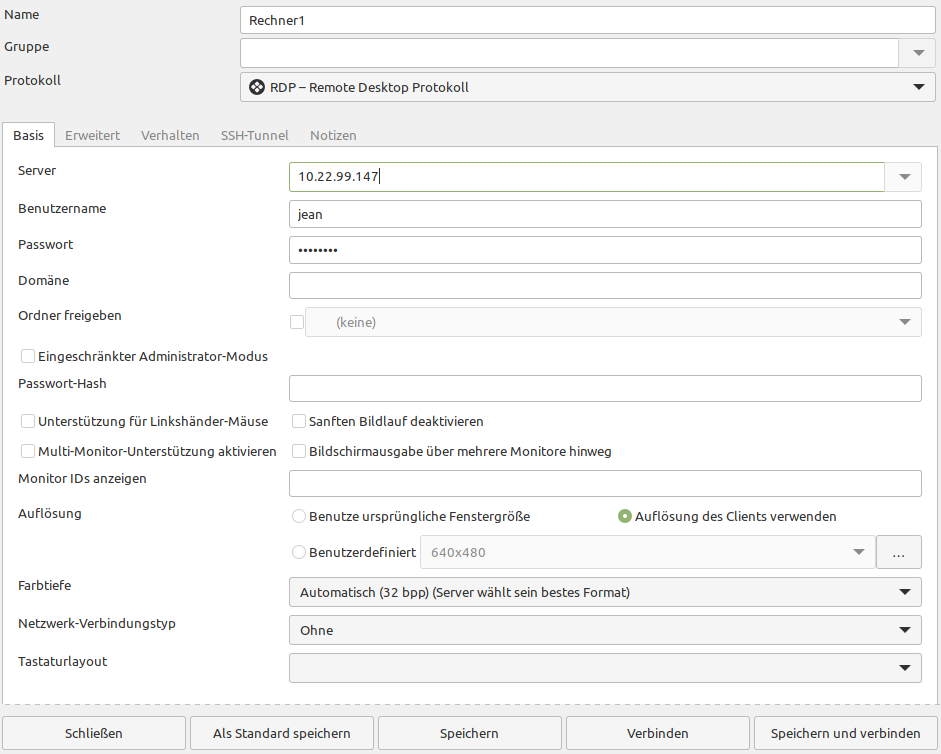

Remotezugriff
=============

Es gibt verschiedene Möglichkeiten, auf einen Rechner über das Netzwerk zuzugreifen.

Die einfachste und gängigste Methode unter Linux ist die *Secure Shell* (SSH).
Diese baut lediglich eine "Terminal"-Verbindung auf.
Für Server-Administratoren ist dies super, für uns als Anwender aber sicher wenig hilfreich.

Neben SSH gibt es noch weitere Methoden, sich mit dem Rechner zu verbinden. 
Eines der verbreitesten Protokolle ist das *Remote Desktop Protokoll* (RDP).
Dadurch kann man durch ein Programm auf den Desktop des entfernten Rechners zugreifen.

Entfernter Rechner
^^^^^^^^^^^^^^^^^^
Um auf unseren Rechner über die Ferne zuzugreifen, müssen wir auf diesem ``Xrdp`` aus der Anwendungsverwaltung installieren.
Außerdem benötigen wir die IP-Adresse unseres Rechners, um auf diesen später zugreifen zu können.
Diese kann man ganz einfach in den Netzwerkeinstellungen unter dem Zahnrad ablesen  (IPv4-Adresse bevorzugt).

.. note:: 
    Wenn die Firewall aktiv ist, muss man in den Firewall-Einstellungen die Anwendung 'RDP' erlauben.

Rechner vor Ort
^^^^^^^^^^^^^^^
Auf diesem Rechner müssen wir lediglich das Programm ``Remmina`` aus der Anwendungsverwaltung installieren.
Wir nehmen in diesem Beispiel die Flatpak Variante.

In Remmina fügen wir eine neue Verbindung links oben über das '+' hinzu.
Als Protokoll wählen wir ``RDP - Remote Desktop Protokoll``
Unter 'Server' tragen wir Dir IP-Adresse des entfernten Rechners ein.
Als Benutzername und Passwort tragen wir die Anmeldedaten des entfernten Rechners ein.
Unter Auflösung ist die Einstellung ``Auflösung des Client verwenden`` empfohlen.
Am Ende können Sie auf ``Speichern und verbinden`` klicken.

Ein korrektes Einstellungsfenster sieht so aus:

.. note:: 
    Ein Benutzer kann grafisch nur einmal angemeldet sein. 
    Es ist nicht möglich, dass der gleiche Benutzer vor Ort und einmal entfernt gleichzeitig angemeldet ist.
    
    Auf dem entfernten Rechner sieht man auch nichts auf dem Bildschirm,
    wenn jemand aus der Ferne angemeldet ist.

    Die Rechner sollten miteinander im gleichen lokalen Netzwerk sein. 

.. tip:: 
    Richtet man zusätzlich eine VPN Verbindung ein, 
    kann man so ohne Probleme auch auf Rechner in hunderten km Entfernung zugreifen.

RustDesk
--------

Eine sehr beliebte Open-Source-Alternative zu bekannten kommerziellen Fernwartungsprogrammen wie TeamViewer oder AnyDesk ist **RustDesk**. Im Gegensatz zu RDP benötigt RustDesk im Standardbetrieb keine aufwendige VPN-Einrichtung oder Portfreigaben im Router, da die Verbindung über öffentliche Vermittlungsserver (Relay-Server) hergestellt wird.

**Vorteile von RustDesk:**
Die Bedienung ist denkbar einfach: Die Verbindung wird unkompliziert per ID und Einmalpasswort aufgebaut (ähnlich wie bei TeamViewer), ganz ohne VPN-Einrichtung. RustDesk läuft auf allen gängigen Systemen (Linux, Windows, macOS, Android, iOS), verschlüsselt standardmäßig Ende-zu-Ende und erlaubt es sogar, einen eigenen Server aufzusetzen, um die volle Kontrolle über die eigenen Daten zu behalten.

**Nachteile von RustDesk:**
Wer die kostenlosen, öffentlichen Server von RustDesk nutzt, muss sich seit einiger Zeit auf dem steuernden Gerät zwingend mit einem Account (z. B. Google, GitHub oder E-Mail) anmelden, um Missbrauch zu verhindern. Zudem teilen Sie sich die Bandbreite mit der restlichen Community, was zu Stoßzeiten zu spürbaren Rucklern oder langsamen Verbindungen führen kann.

.. note::
   Wer die Registrierungspflicht umgehen und maximale Privatsphäre genießen möchte, kann sich relativ einfach einen eigenen RustDesk-Server (bestehend aus den Diensten ``hbbs`` und ``hbbr``) auf einem eigenen Minicomputer (z. B. Raspberry Pi) oder einem virtuellen Server im Internet einrichten.