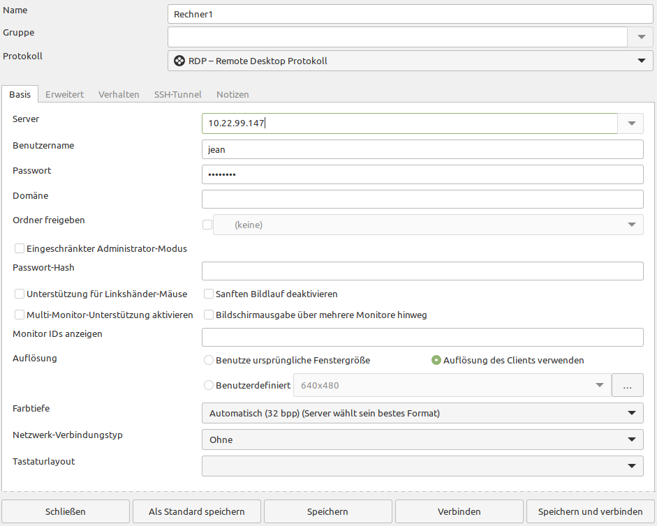

Remotezugriff
=============

Es gibt verschiedene Möglichkeiten, auf einen Rechner über das Netzwerk zuzugreifen.

Die einfachste und gängigste Methode unter Linux ist die *Secure Shell* (SSH).
Diese baut lediglich eine "Terminal"-Verbindung auf.
Für Server-Administratoren ist dies super, für uns als Anwender aber sicher wenig hilfreich.

Neben SSH gibt es noch weitere Methoden, sich mit dem Rechner zu verbinden. 
Eines der verbreitesten Protokolle ist das *Remote Desktop Protokoll* (RDP).
Dadurch kann man mit einem Programm auf den Desktop des entfernten Rechners zugreifen.

Entfernter Rechner
^^^^^^^^^^^^^^^^^^
Um auf unseren Rechner über die Ferne zuzugreifen, müssen wir auf diesem ``Xrdp`` aus der Anwendungsverwaltung installieren.
Außerdem benötigen wir die IP-Adresse unseres Rechners, um auf diesen später zugreifen zu können.
Dies kann man ganz einfach in den Netzwerkeinstellungen ablesen.

.. note:: 
    Wenn die Firewall aktiv ist, muss man in den Firewall-Einstellungen die Anwendung 'RDP' erlauben.

Rechner vor Ort
^^^^^^^^^^^^^^^
Auf diesem Rechner müssen wir lediglich das Programm ``Remmina`` aus der Anwendungsverwaltung installieren.
Wir nehmen in diesem Beispiel die Flatpak Variante.

In Remmina fügen wir eine neue Verbindung links oben über das '+' hinzu.
Als Protokoll wählen wir ``RDP - Remote Desktop Protokoll``
Unter 'Server' tragen wir Dir IP-Adresse des entfernten Rechners ein.
Als Benutzername und Passwort tragen wir die Anmeldedaten des entfernten Rechners ein.
Unter Auflösung ist die Einstellung ``Auflösung des Client verwenden`` empfohlen.
Am Ende können Sie auf ``Speichern und verbinden`` klicken.

Ein korrektes Einstellungsfenster sieht so aus:

.. note:: 
    Ein Benutzer kann grafisch nur einmal angemeldet sein. 
    Es ist nicht möglich, dass der gleiche Benutzer vor Ort und einmal entfernt gleichzeitig angemeldet ist.
    
    Auf dem entfernten Rechner sieht man auch nichts auf dem Bildschirm,
    wenn jemand aus der Ferne angemeldet ist.

    Die Rechner sollten miteinander im gleichen lokalen Netzwerk sein. 

.. tip:: 
    Richtet man zusätzlich eine VPN Verbindung ein, 
    kann man so ohne Probleme auch auf Rechner in hunderten km Entfernung zugreifen.