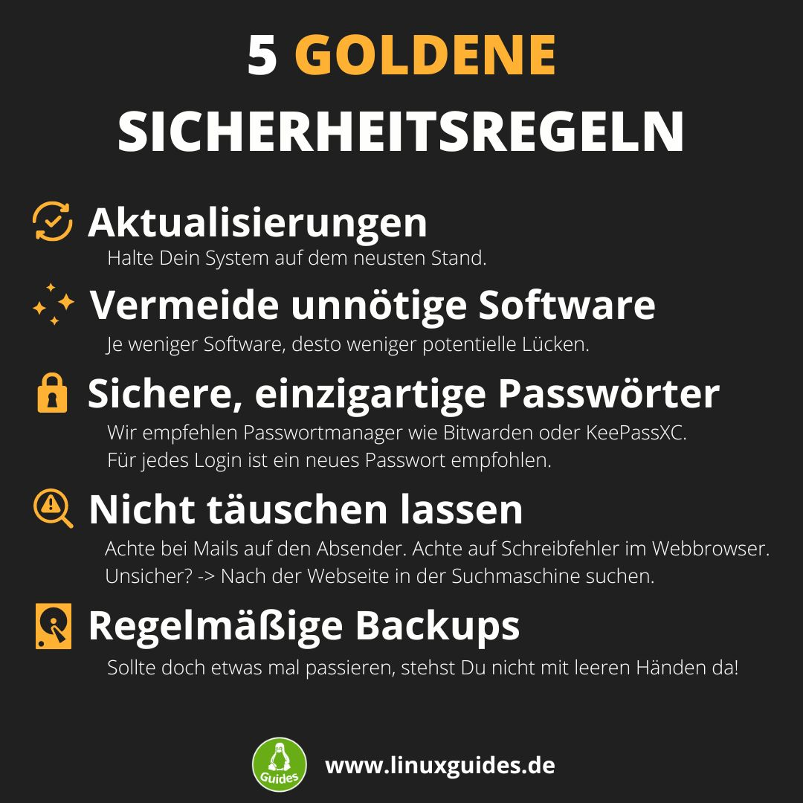

Linux Mint sicher nutzen
========================

Updates
-------

Ein Großteil aller Hackerangriffe nutzt Sicherheitslücken aus,
die in alten Programmversionen enthalten sind.
Deswegen sind Aktualisierungen sehr wichtig.

Lesen Sie dafür den Abschnitt *Aktualisierungsverwaltung* im Kapitel *Ersteinrichtung*.

Wine deinstallieren
-------------------

Wine ist eine Laufzeitumgebung für Windows-Programme.
Windows-Viren können dadurch unter Umständen auch unter Linux aktiv werden,
falls Wine installiert ist.
Sollten Sie also nicht aktiv ein Windows-Programm auf Linux nutzen,
deinstallieren Sie Wine.

Generell rate ich Ihnen von der Nutzung von Windows-Programmen unter Linux ab,
da dies oft zu einer eingeschränkten Benutzererfahrung führt.

Wine ist standardmäßig nicht installiert.

Webbrowser sicher einrichten
----------------------------

Lesen Sie dafür den Abschnitt Firefox im Kapitel *Nützliche Programme*.
Mit anderen Webbrowsern funktioniert die Einrichtung genauso.

Virenschutz
-----------

Unter Linux benötigen Sie keinen zusätzlichen Virenschutz.
Viele Experten empfehlen, auch unter Windows auf zusätzliche Antivirensoftware zu verzichten: (`https://youtu.be/NDlYeJSyqeU <https://youtu.be/NDlYeJSyqeU>`_)

Ein Virenprogramm bietet keinen zusätzlichen Schutz:

- wenn Ihr Linux-System aktuell ist,
- wenn Sie nur so viele Anwendungen wie nötig auf Ihrem System installiert haben,
- wenn Sie nicht wahllos externe Anwendungen (außerhalb der Anwendungsverwaltung) installieren,
- und wenn Sie keine unbekannten Anhänge aus E-Mails öffnen.

Selbst wenn Sie einen Fehler machen:
In der Praxis versagen Virenschutzprogramme leider immer noch viel zu häufig.
Möchten Sie Ihren Verstand beim Nutzen des Computers ausschalten,
sollten Sie den Rechner am besten gar nicht erst einschalten.

.. note::
    Nutzen Sie einfach ``brain.sh`` (Ihren gesunden Menschenverstand – das beste Antivirenprogramm auf dem Markt)
    und befolgen Sie die Tipps in diesem Kapitel und in den 5 Goldenen Sicherheitsregeln am Ende dieses Kapitels.
    Ihre Sicherheit unter Linux ist daraufhin extrem hoch.

Passwortmanager
---------------

Nutzen Sie Passwortmanager!
Wichtig ist, dass Sie für jede Anmeldung ein komplett neues, **sicheres** Passwort verwenden.
Dabei ist es egal, ob Sie sich alle Passwörter für jede Anmeldung merken, diese auf Zettel schreiben
oder einen Passwortmanager wie das freie Open-Source-Programm ``Bitwarden`` verwenden.
Eine Alternative ist beispielsweise ``KeePassXC``.

.. note::
    Unter einem sicheren Passwort verstehe ich folgende Kriterien:

    - Länge über 20 Zeichen,
    - Sonderzeichen enthalten,
    - Zahlen enthalten,
    - Groß- und Kleinbuchstaben enthalten,
    - enthält keine auf Sie zurückführbaren Informationen.

    Zum Generieren sicherer Passwörter empfehle ich Ihnen den ersten Teil dieses `Videos <https://youtu.be/MNQxg7uyE3I?t=71>`_.

Backups
-------

Machen Sie regelmäßig Backups von Ihren Dateien.
Dies ist Ihre Lebensversicherung.
Weitere Informationen finden Sie im Kapitel **Backups**.

Fremdquellen
------------

Achten Sie darauf, welche Anwendungspaketquellen (PPAs, weitere Fremdquellen) auf Ihrem System aktiviert sind.
Solche Quellen können auch böswillig ausgenutzt werden.

Eine Übersicht erhalten Sie im Programm ``Anwendungspaketquellen``.

5 Goldene Sicherheitsregeln
---------------------------

Zusammenfassend lässt sich die Sicherheit Ihres Systems auf fünf goldene Regeln reduzieren.
Wenn Sie diese beherzigen,
ist Ihr Linux-System extrem sicher:

|

1. **Aktualisierungen (Updates):**
   Sobald Sicherheitslücken bekannt werden, schließen Entwickler sie über Sicherheitsupdates.
   Angreifer suchen gezielt nach Systemen mit veralteter Software, um diese Schwachstellen auszunutzen.
   Halten Sie Ihr System und Ihre Programme daher immer aktuell.
   Die Aktualisierungsverwaltung von Linux Mint macht Ihnen das sehr einfach – richten Sie dort am besten automatische Updates für Systempakete und Flatpaks ein (wie im Kapitel *Ersteinrichtung* beschrieben).

2. **Vermeidung unnötiger Software:**
   Wenn ein Programm eine Sicherheitslücke aufweist, kann dies das gesamte System gefährden – selbst wenn Sie die Anwendung nur selten nutzen.
   Installieren Sie daher nur Software, die Sie wirklich brauchen, und entfernen Sie nicht mehr benötigte Programme.
   Weniger installierte Software bedeutet schlichtweg weniger potenzielle Einfallstore für Schadcode.

3. **Sichere, einzigartige Passwörter:**
   Wird ein einziger Online-Dienst gehackt, haben Angreifer sofort Zugriff auf all Ihre Konten bei anderen Plattformen.
   Verwenden Sie für jeden Zugang ein eigenes, langes und zufälliges Passwort.
   Da Sie sich diese unmöglich alle merken können,
   ist der Einsatz eines Passwortmanagers wie **Bitwarden** oder **KeePassXC** dringend zu empfehlen.
   Sie müssen sich dann nur noch ein einziges Master-Passwort merken.

4. **Nicht täuschen lassen (Phishing & Social Engineering):**
   Da Desktop-Systeme selbst mittlerweile nahezu unerreichbar sind, versuchen Kriminelle meist, den Menschen vor dem Bildschirm auszutricksen.
   Sie versenden täuschend echte E-Mails von Banken oder Paketdiensten und verlinken auf gefälschte Login-Seiten, um Zugangsdaten abzugreifen.
   Seien Sie stets misstrauisch: Klicken Sie nicht voreilig auf Links,
   prüfen Sie die Absenderadresse und achten Sie im Browser auf Tippfehler in der Adresszeile (z. B. ``paypal-sicherheit.de`` statt ``paypal.com``).
   Im Zweifel rufen Sie die Seite manuell über eine Suchmaschine auf.

5. **Regelmäßige Backups:**
   **Es gibt keine hundertprozentige Sicherheit.** Hardware kann kaputtgehen,
   Dateien können versehentlich gelöscht werden oder das System nimmt bei einem Fehler Schaden.
   Ein Backup ist Ihre absolute Lebensversicherung.
   Sichern Sie Ihre persönlichen Daten (Dokumente, Fotos) regelmäßig auf eine externe Festplatte oder einen Netzwerkspeicher.
   Linux Mint bietet dafür mit **Pika Backup** (für Dateien) und **Timeshift** (für das System) hervorragende Werkzeuge.
   Details dazu finden Sie im Kapitel **Backups**.
